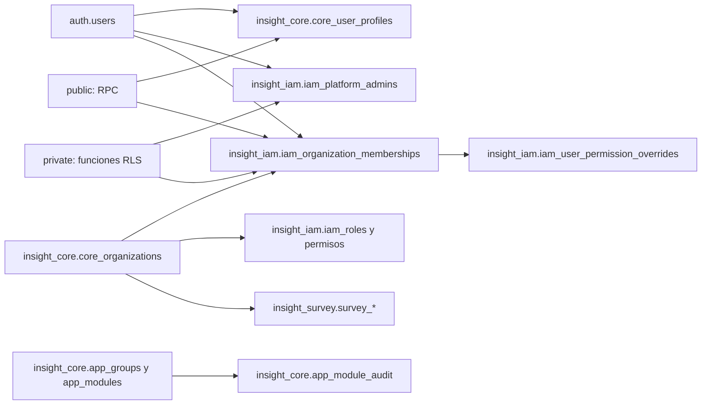

Sí. Con lo que cerramos por voz ya hay suficiente para fijar una arquitectura sin inventar requisitos adicionales.

# Intersel Insight — Capa Multi-organización e IAM

> **Fuente de arquitectura.** La sección «Estado aplicado» documenta la base verificada hasta el 2026-10-02; el resto del documento conserva el modelo funcional objetivo multi-organización. Para conocer qué módulos de la app ya usan ese modelo, consulta [`docs/MAPA_MODULOS.md`](docs/MAPA_MODULOS.md) y verifica el código.

## Estado aplicado de la base de datos (2026-10-02)

| Schema | Propiedad | Objetos y responsabilidad |
|---|---|---|
| `auth` | Supabase (`supabase_admin`) | Usuarios, identidades y sesiones; no se renombra ni se administra desde las migraciones propias. |
| `insight_core` | `insight_app` | `core_organizations`, `core_user_profiles`; catálogo `app_groups` y `app_modules`, y auditoría. |
| `insight_iam` | `insight_app` | Diez tablas `iam_*`: administradores globales, membresías, roles, permisos, catálogos y acceso a recursos. |
| `insight_survey` | `insight_app` | Estudios, instrumentos, versiones, preguntas, observaciones, respuestas, trabajos de importación y secuencias de códigos `survey_*`. |
| `private` | `insight_app` | Dos funciones auxiliares de RLS: `is_platform_admin`, `active_organization_ids`. |
| `public` | Supabase/Postgres | Diez RPC de aplicación que permiten operaciones acotadas desde la Data API. |



- La migración aplicada está en [`scripts/011_reorganize_schemas.sql`](scripts/011_reorganize_schemas.sql). `platform`, `intersel_insight` y el schema vacío `survey` se retiraron; las 23 tablas conservaron sus datos, propietario, identificadores, políticas y RLS activo.
- [`scripts/012_insight_module_catalog.sql`](scripts/012_insight_module_catalog.sql) introdujo el catálogo y la auditoría en `insight_core`. En esa migración los niveles se llamaban `app_modules`/`app_submodules`; el nombre final se normalizó en la 014.
- [`scripts/013_insight_control_plane.sql`](scripts/013_insight_control_plane.sql) retiró Insight del catálogo editable y reservó su espacio. El grupo fijo **Insight / Grupos y módulos** vive en código y siempre está disponible para `sysadmin`, aun si todos los grupos gestionables están apagados. No tiene estado ni concesión por organización.
- [`scripts/014_catalog_groups_modules.sql`](scripts/014_catalog_groups_modules.sql) renombró las tablas y relaciones del catálogo: `app_groups` contiene los grupos, `app_modules` sus módulos, `app_module_entitlements` las concesiones por organización y `app_module_audit` la bitácora de cambios. También actualizó el tipo de entidad en la auditoría y el trigger de concesiones. La base conserva 4 grupos y 10 módulos.
- [`scripts/015_remove_ready_state.sql`](scripts/015_remove_ready_state.sql) retiró `listo`, convirtió el grupo que lo usaba a `desarrollo` y eliminó `app_module_entitlements`, sus triggers y su función. Antes de eliminarla se verificó que las 20 concesiones estuvieran sin asignación y habilitadas por defecto. La base conserva 4 grupos y 10 módulos.
- [`scripts/016_catalog_operate_permissions.sql`](scripts/016_catalog_operate_permissions.sql) sincroniza cada `app_modules.code` con `iam_modules.code` y crea su permiso `<code>.operar` mediante trigger. Se aplicó como `insight_app` y se confirmaron 10 permisos `operar` para 10 módulos. La migración los asignó a los roles existentes para conservar la visibilidad inicial. Los nuevos módulos reciben el permiso, pero su asignación a roles o usuarios se decide por separado.
- [`scripts/017_single_sysadmin.sql`](scripts/017_single_sysadmin.sql) conserva únicamente la organización «Hermosillo ¿Cómo vamos?» creada en la app, donde José Luis es Owner; retira la organización inicial sembrada tras comprobar que carecía de datos de negocio. `sysadminodin@temikia.com` es el único `sysadmin` global en `iam_platform_admins`, sin membresías. Una restricción única impide un segundo `sysadmin`; triggers verifican la identidad maestra, protegen ese registro e impiden asignarle membresías. `iam_roles` reserva el código `sysadmin` para el nivel global. La RPC `list_org_members` excluye a los administradores globales.
- [`scripts/018_managed_admin_modules.sql`](scripts/018_managed_admin_modules.sql) incorporó Roles y Permisos a `app_modules` bajo Administración, en estado `desarrollo`, con sus permisos `operar`. El trigger de alta concede `operar` a los roles existentes cuando se crea cualquier módulo. Su acceso ejecutable conserva la exigencia de sysadmin y ahora también respeta el estado del catálogo en página y API.
- [`scripts/019_retire_legacy_organization_module.sql`](scripts/019_retire_legacy_organization_module.sql) retiró el módulo provisional «Organización» de Administración y su permiso `operar`, tras comprobar que no tenía acciones adicionales ni concesiones individuales o de recursos. Su auditoría permanece; el gestor real de Organizaciones vive en el grupo fijo Insight. El catálogo aplicado contiene 4 grupos y 12 módulos.
- [`scripts/020_survey_catalog.sql`](scripts/020_survey_catalog.sql) registró **Encuestas / Encuestas** como grupo y módulo gestionables, enlazados a `/surveys`. El módulo consulta estudios, instrumentos, versiones y cuestionarios de `insight_survey`. El permiso `encuestas.operar` se conservó en los roles existentes que ya tenían `survey.access` y `survey.view`; las consultas vuelven a comprobar esos permisos por organización y respetan los recursos `survey` restringidos por instrumento. En la base inspeccionada al aplicar esta migración también persistía el módulo provisional `organizacion`, por lo que el catálogo observado suma 5 grupos y 14 módulos; esa discrepancia con el registro de la 019 queda pendiente de reconciliar por separado.
- **Carga y consulta HCV 2025 (2026-09-29):** [`scripts/import-hcv-2025.js`](scripts/import-hcv-2025.js) cargó en una transacción el estudio `HCV_PERCEPCION_2025` con los instrumentos A y B, 426 preguntas, 3,231 observaciones y 689,036 respuestas. La carga conserva los valores originales y corrige dos permutaciones verificadas de columnas en A; detalles y hashes en [`docs/ENCUESTAS_HCV_2025.md`](docs/ENCUESTAS_HCV_2025.md). La ruta `/surveys/[id]/responses` consulta observaciones paginadas de la versión actual y sus respuestas individuales con los permisos de organización y recurso del instrumento.
- **Importaciones reutilizables (2026-09-29):** [`scripts/021_survey_import_jobs.sql`](scripts/021_survey_import_jobs.sql) y [`scripts/022_serverless_survey_imports.sql`](scripts/022_serverless_survey_imports.sql) se aplicaron como `insight_app`. `insight_survey.survey_import_jobs` guarda organización, creador, ruta de archivo privado, SHA-256, vista previa, asignación de columnas, ejecución de Workflow y estado; `source_bytes` permanece opcional para tareas antiguas. `survey_import_job_chunks` registra bloques transaccionales e idempotentes. `/surveys/imports` acepta TXT, CSV, XLSX, XLS, ODS y JSON, exige `survey.access` + `survey.create` y permite revisar y reasignar columnas antes de confirmar. En hojas de cálculo solo se lee la primera hoja, sin diccionario. El navegador sube directamente al bucket privado `survey-imports` y una ejecución de Workflow de Vercel inicia bajo demanda; no hay trabajador residente. La versión se publica únicamente tras verificar todos los bloques. El remapeo especial de HCV A no se aplica automáticamente a cargas generales.
- **Prefijos y códigos de encuestas (2026-10-02):** [`scripts/023_organization_prefix_survey_codes.sql`](scripts/023_organization_prefix_survey_codes.sql) se aplicó como `insight_app` y se verificó en la base. `core_organizations.code_prefix` es único, obligatorio y contiene tres caracteres alfanuméricos mayúsculos; los existentes quedaron como HCV e INT. `survey_code_sequences` guarda dos contadores globales por organización, independientes para estudios e instrumentos, protegidos con RLS. `survey_import_jobs.version` guarda la versión completa con parte decimal (`1.0`, `1.542`, etc.). El formulario solicita solo el entero y el servidor genera los códigos y la versión `.0`; reutiliza estudios e instrumentos por nombre dentro de su organización y rechaza la misma versión de un instrumento existente o en carga. Los códigos históricos se conservan.
- **Insight / Organizaciones** es un control fijo para sysadmin. Su API crea y edita `core_organizations`; el alta genera cinco roles de organización, da todos los permisos vigentes a Owner y el permiso `operar` a los demás roles. La cuenta maestra no se añade como miembro. El estado de la organización puede pasar por activa, inactiva, suspendida o archivada; el ID permanece estable.
- Los estados vigentes de grupos y módulos gestionables son `apagado` (nadie, tampoco `sysadmin`), `desarrollo` (solo `sysadmin`) y `disponible` (usuarios con membresía activa y permiso `operar`). El grupo limita a sus módulos. La auditoría registra altas y cambios. Las tablas privadas tienen RLS activo y ningún acceso directo de `anon` ni `authenticated`; el gestor valida `sysadmin` antes de usar `insight_app`.
- `iam_modules` agrupa permisos y comparte el código de cada módulo gestionable con `app_modules`. El catálogo `app_*` describe navegación y disponibilidad. Los módulos con página propia usan la ruta registrada en código; los nuevos sin implementación reciben `/workspace/[code]` como área de trabajo provisional. El menú y las guardas del catálogo evalúan `<code>.operar` por membresía activa: una excepción individual `deny` prevalece sobre el rol y `allow` concede acceso. Roles y Permisos se muestran en **Administración** según su estado, pero conservan acceso exclusivo de `sysadmin`; Componentes y Organizaciones siguen en el grupo fijo Insight.
- Las guardas de catálogo aplican a las páginas existentes y a sus rutas hijas. Los permisos de acciones y los datos de cada módulo v1 siguen requiriendo sus propios controles IAM/RLS durante su migración; el catálogo no sustituye esos controles.
- Los tres schemas `insight_*` no están expuestos directamente por la Data API. Las funciones necesarias para la app siguen en `public`; sus cuerpos se actualizaron a los nuevos nombres. `authenticated` tiene `USAGE` en los schemas propios y en `private`, pero cada tabla conserva sus grants y políticas específicos.
- `auth.users(id)` sigue siendo la referencia de identidad. Contraseñas, verificación de correo y sesiones siguen bajo Supabase Auth. No duplicar autenticación en un schema `insight_auth`.
- `insight_app` es el rol SQL dedicado y dueño de los objetos propios; `scripts/run-sql.js` lo usa por defecto. `postgres` se reserva para operaciones de DBA explícitas con `--admin`, por ejemplo crear objetos que referencien `auth.users` o modificar funciones de `public`.
- La app Next.js accede normalmente mediante Supabase Auth/Data API. `SUPABASE_SERVICE_ROLE_KEY` y las URL SQL de `insight_app` son credenciales diferentes y solo se usan en servidor. Como dueño de las tablas, `insight_app` puede omitir RLS mientras no se active `FORCE ROW LEVEL SECURITY`; su acceso se limita a procesos confiables.
- `insight_admin` queda reservado para una responsabilidad administrativa independiente si llega a existir. No se creó un schema vacío por anticipado. Los módulos de app que aún usan `tenant_id`/`profiles`/`tenants` siguen pendientes de migración funcional; el cambio de schemas no los convirtió en v2.

La decisión central sería esta:

> **Una instalación de Intersel Insight puede contener múltiples organizaciones. Todos los datos privados pertenecen explícitamente a una organización. Los usuarios son globales a la instalación y pueden pertenecer a una o varias organizaciones con permisos diferentes en cada una.**

No estamos construyendo todavía un SaaS completo. Estamos construyendo una aplicación **multi-organización desde su núcleo**, de forma que inicialmente pueda existir solamente:

```text
Intersel Insight
└── Hermosillo ¿Cómo Vamos?
```

y posteriormente:

```text
Intersel Insight
├── Hermosillo ¿Cómo Vamos?
├── Intercel
├── Organización X
└── Organización Y
```

Además, el mismo software puede desplegarse independientemente:

```text
Instalación A
Intersel Insight
├── Hermosillo ¿Cómo Vamos?
└── Intercel

Instalación B
Intersel Insight
└── Cliente privado X
```

No necesitamos `installation_id`. **La instalación es el deployment.**

## Terminología del producto

Intersel Insight se define como una aplicación **multi-organización, no multitenant**. Una instalación (deployment) puede alojar varias organizaciones dentro de la misma aplicación. La organización es el ámbito de pertenencia, autorización y aislamiento de los datos; no representa un deployment independiente ni un tenant de infraestructura.

En este documento, cualquier uso de “tenant” o “multi-tenant” debe entenderse como terminología heredada para referirse al aislamiento entre organizaciones. En nombres nuevos de tablas, columnas, políticas y código se debe usar `organization` / `organization_id`.

---

# 1. Separación conceptual

No mezclaría todo bajo `survey_*`.

La aplicación empieza a tener dominios claramente diferentes:

```text
core_*
    estructura principal de la plataforma

iam_*
    Identity & Access Management

survey_*
    encuestas

analytics_*
    análisis derivados

dashboard_*
    visualizaciones

dataset_*
    datasets externos/importados

indicator_*
    indicadores públicos
```

Esto último es importante para la evolución futura.

Por ejemplo, INEGI **no debería transformarse artificialmente en una encuesta** sólo porque actualmente la aplicación nació alrededor de encuestas.

Podría terminar existiendo algo como:

```text
dataset_sources
dataset_imports
dataset_versions
dataset_records

indicator_sources
indicator_catalog
indicator_series
indicator_values
```

pero **no lo diseñaría todavía**. Simplemente evitamos que el diseño actual nos obligue a meterlo después dentro de `survey_*`.

---

# 2. Estructura superior

La jerarquía lógica sería:

```text
INSTALLATION
│
├── USERS
│
├── PLATFORM ACCESS
│   └── SYSADMIN
│
└── ORGANIZATIONS
    │
    ├── MEMBERS
    │   └── ROLES
    │       └── PERMISSIONS
    │
    ├── USER OVERRIDES
    │
    ├── RESOURCE ACCESS
    │
    └── BUSINESS DATA
        ├── survey_*
        ├── analytics_*
        ├── dashboard_*
        └── ...
```

La consecuencia importante es:

**usuario ≠ miembro de organización.**

Una persona existe una sola vez.

Después tiene memberships.

Ejemplo:

```text
Usuario: ana@intercel.com

Hermosillo ¿Cómo Vamos?
└── Analista

Intercel
└── Administrador

Cliente XYZ
└── Viewer
```

No duplicamos a Ana tres veces.

---

# 3. `core_organizations`

Es la entidad que delimita una organización dentro de una instalación de Intersel Insight.

```sql
CREATE TABLE core_organizations (
    id UUID PRIMARY KEY DEFAULT gen_random_uuid(),

    name TEXT NOT NULL,
    slug TEXT NOT NULL UNIQUE,

    status TEXT NOT NULL DEFAULT 'active'
        CHECK (status IN (
            'active',
            'inactive',
            'suspended',
            'archived'
        )),

    timezone TEXT NOT NULL DEFAULT 'America/Hermosillo',

    settings JSONB NOT NULL DEFAULT '{}'::jsonb,

    created_at TIMESTAMPTZ NOT NULL DEFAULT now(),
    updated_at TIMESTAMPTZ NOT NULL DEFAULT now()
);
```

Ejemplo:

```text
id      932...
name    Hermosillo ¿Cómo Vamos?
slug    hermosillo-como-vamos
status  active
```

`settings` sirve para configuraciones relativamente pequeñas de organización que no ameriten inicialmente una tabla propia.

No lo utilizaría como vertedero de configuración.

---

# 4. Usuarios

Si están trabajando con Supabase Auth, **no duplicaría autenticación**.

Tendríamos:

```text
auth.users
    ↓
core_user_profiles
```

Por ejemplo:

```sql
CREATE TABLE core_user_profiles (
    user_id UUID PRIMARY KEY
        REFERENCES auth.users(id)
        ON DELETE CASCADE,

    display_name TEXT,
    avatar_url TEXT,

    status TEXT NOT NULL DEFAULT 'active'
        CHECK (status IN ('active', 'disabled')),

    created_at TIMESTAMPTZ NOT NULL DEFAULT now(),
    updated_at TIMESTAMPTZ NOT NULL DEFAULT now()
);
```

Contraseñas, email verification, tokens, etc. siguen siendo responsabilidad de `auth.users`.

---

# 5. Sysadmin: separado de los roles empresariales

No metería a tu usuario `sysadmin` dentro de:

```text
organization_roles
```

porque conceptualmente no pertenece al mismo nivel.

El sysadmin gobierna **la instalación completa**.

Podemos manejarlo mediante:

```sql
CREATE TABLE iam_platform_admins (
    user_id UUID PRIMARY KEY
        REFERENCES auth.users(id)
        ON DELETE CASCADE,

    role TEXT NOT NULL
        CHECK (role IN (
            'sysadmin'
        )),

    created_at TIMESTAMPTZ NOT NULL DEFAULT now()
);
```

Inicialmente sólo necesitamos:

```text
sysadmin
```

No inventaría cinco niveles de administración global que actualmente no existen.

Tu usuario:

```text
Cheshire
└── SYSADMIN
```

puede atravesar todas las organizaciones.

Ese es efectivamente el **God Mode** de la instalación.

---

# 6. Memberships

Esta es una de las tablas más importantes.

```sql
CREATE TABLE iam_organization_memberships (
    id UUID PRIMARY KEY DEFAULT gen_random_uuid(),

    organization_id UUID NOT NULL
        REFERENCES core_organizations(id)
        ON DELETE CASCADE,

    user_id UUID NOT NULL
        REFERENCES auth.users(id)
        ON DELETE CASCADE,

    status TEXT NOT NULL DEFAULT 'active'
        CHECK (status IN (
            'invited',
            'active',
            'suspended',
            'revoked'
        )),

    joined_at TIMESTAMPTZ,
    created_at TIMESTAMPTZ NOT NULL DEFAULT now(),
    updated_at TIMESTAMPTZ NOT NULL DEFAULT now(),

    UNIQUE (organization_id, user_id)
);
```

Esto permite exactamente el escenario que definimos.

```text
                 ORGANIZATIONS

              ┌── Hermosillo ¿Cómo Vamos?
Ana ──────────┤
              └── Intercel

Carlos ────────── Hermosillo ¿Cómo Vamos?

Juan ──────────── Intercel
```

---

# 7. Roles

Aquí no usaría:

```text
user.role
```

ni:

```text
membership.role
```

como un solo campo.

Queremos flexibilidad.

Un usuario eventualmente puede tener más de un rol.

Por tanto:

```text
membership
   ↓
membership_roles
   ↓
roles
```

Tabla:

```sql
CREATE TABLE iam_roles (
    id UUID PRIMARY KEY DEFAULT gen_random_uuid(),

    organization_id UUID NOT NULL
        REFERENCES core_organizations(id)
        ON DELETE CASCADE,

    code TEXT NOT NULL,
    name TEXT NOT NULL,
    description TEXT,

    is_system BOOLEAN NOT NULL DEFAULT false,
    is_editable BOOLEAN NOT NULL DEFAULT true,

    created_at TIMESTAMPTZ NOT NULL DEFAULT now(),
    updated_at TIMESTAMPTZ NOT NULL DEFAULT now(),

    UNIQUE (organization_id, code)
);
```

Roles iniciales podrían ser:

```text
Owner
Administrator
Analyst
Operator
Viewer
```

pero esto **no convierte esos cinco roles en la arquitectura**.

Son sólo presets.

Una organización podría crear:

```text
Responsable de Encuestas
Supervisor de Campo
Contabilidad
Dirección
Coordinación de Investigación
Analista Senior
```

---

# 8. Membership ↔ Roles

```sql
CREATE TABLE iam_membership_roles (
    membership_id UUID NOT NULL
        REFERENCES iam_organization_memberships(id)
        ON DELETE CASCADE,

    role_id UUID NOT NULL
        REFERENCES iam_roles(id)
        ON DELETE CASCADE,

    PRIMARY KEY (
        membership_id,
        role_id
    )
);
```

Con esto:

```text
Catalina
│
├── Organización A
│   ├── Analista
│   └── Finanzas
│
└── Organización B
    └── Viewer
```

es perfectamente válido.

---

# 9. Catálogo de módulos

Conviene separar módulo de permiso.

```sql
CREATE TABLE iam_modules (
    id UUID PRIMARY KEY DEFAULT gen_random_uuid(),

    code TEXT NOT NULL UNIQUE,
    name TEXT NOT NULL,
    description TEXT,

    active BOOLEAN NOT NULL DEFAULT true,

    sort_order INTEGER NOT NULL DEFAULT 0
);
```

Ejemplos:

```text
organization
users
survey
analytics
dashboard
datasets
indicators
finance
```

Esto ayudará muchísimo cuando construyan posteriormente la UI:

```text
Rol: Analista

Encuestas
[x] Acceder
[x] Consultar
[x] Crear
[x] Modificar
[ ] Eliminar
[ ] Exportar

Dashboards
[x] Acceder
[x] Consultar
[ ] Crear
...
```

---

# 10. Permisos

Los permisos deberían ser atómicos.

No:

```text
survey = true
```

Sino:

```text
survey.access
survey.view
survey.create
survey.update
survey.delete
survey.export
survey.manage_access
```

DDL:

```sql
CREATE TABLE iam_permissions (
    id UUID PRIMARY KEY DEFAULT gen_random_uuid(),

    module_id UUID NOT NULL
        REFERENCES iam_modules(id),

    code TEXT NOT NULL UNIQUE,

    action TEXT NOT NULL,

    description TEXT,

    supports_resource_scope BOOLEAN NOT NULL DEFAULT false
);
```

Ejemplos:

```text
survey.access
survey.view
survey.create
survey.update
survey.delete
survey.export
survey.manage_access

analytics.access
analytics.view
analytics.create
analytics.export

organization.view
organization.update

members.view
members.invite
members.update
members.remove

roles.view
roles.create
roles.update
roles.delete
```

Esto nos da un sistema extensible sin modificar la estructura cada vez que aparezca una nueva funcionalidad.

---

# 11. Role Permissions

Aquí haría algo deliberadamente simple:

### Los roles sólo otorgan permisos.

No manejaría DENY en roles.

```sql
CREATE TABLE iam_role_permissions (
    role_id UUID NOT NULL
        REFERENCES iam_roles(id)
        ON DELETE CASCADE,

    permission_id UUID NOT NULL
        REFERENCES iam_permissions(id)
        ON DELETE CASCADE,

    PRIMARY KEY (
        role_id,
        permission_id
    )
);
```

Esto evita problemas absurdos como:

```text
Rol A → permite exportar
Rol B → niega exportar

Usuario tiene A + B

¿qué hacemos?
```

La respuesta desaparece.

Los roles son acumulativos:

```text
Rol A + Rol B = unión de permisos
```

Las excepciones viven en otra capa.

---

# 12. Overrides por usuario

Aquí resolvemos exactamente el ejemplo de Juanito y Catalina.

Supongamos:

```text
Rol: Contabilidad

finance.view      ALLOW
finance.export    ALLOW
```

Juan y Catalina tienen el mismo rol.

Pero:

```text
Juan
finance.export → DENY

Catalina
sin override
```

Resultado:

```text
               VIEW    EXPORT

Catalina        ✓         ✓
Juan            ✓         ✕
```

Tabla:

```sql
CREATE TABLE iam_user_permission_overrides (
    id UUID PRIMARY KEY DEFAULT gen_random_uuid(),

    membership_id UUID NOT NULL
        REFERENCES iam_organization_memberships(id)
        ON DELETE CASCADE,

    permission_id UUID NOT NULL
        REFERENCES iam_permissions(id)
        ON DELETE CASCADE,

    effect TEXT NOT NULL
        CHECK (effect IN ('allow', 'deny')),

    reason TEXT,

    created_at TIMESTAMPTZ NOT NULL DEFAULT now(),

    UNIQUE (
        membership_id,
        permission_id
    )
);
```

Uso `membership_id`, no `user_id`.

Eso es importante.

Porque:

```text
Juan @ Organización A
```

y:

```text
Juan @ Organización B
```

son contextos de autorización completamente diferentes.

---

# 13. Resolución de permisos

La regla debe quedar congelada en la documentación desde ahora.

Para permisos generales:

```text
1. ¿Es SYSADMIN?
      ↓ sí
   ALLOW

2. ¿Tiene membership ACTIVE?
      ↓ no
   DENY

3. ¿Existe USER OVERRIDE?
      ↓
   ALLOW / DENY según override

4. Revisar todos los roles del membership
      ↓

5. ¿Alguno otorga el permiso?
      ↓ sí
   ALLOW

6. En cualquier otro caso
   DENY
```

O expresado como:

```text
DEFAULT = DENY
```

Nunca:

```text
DEFAULT = ALLOW
```

---

# 14. Permisos sobre recursos específicos

Tenemos además el requisito:

> Un usuario puede tener acceso al módulo Encuestas pero solamente a determinadas encuestas.

No hace falta introducir todavía proyectos, estudios ni una jerarquía compleja.

Añadiría una pequeña capa de recursos.

## `iam_resources`

```sql
CREATE TABLE iam_resources (
    id UUID PRIMARY KEY DEFAULT gen_random_uuid(),

    organization_id UUID NOT NULL
        REFERENCES core_organizations(id)
        ON DELETE CASCADE,

    resource_type TEXT NOT NULL,

    domain_resource_id TEXT NOT NULL,

    access_mode TEXT NOT NULL DEFAULT 'organization'
        CHECK (
            access_mode IN (
                'organization',
                'restricted'
            )
        ),

    created_at TIMESTAMPTZ NOT NULL DEFAULT now(),

    UNIQUE (
        organization_id,
        resource_type,
        domain_resource_id
    )
);
```

Ejemplo:

```text
resource_type       survey
domain_resource_id  831
organization        HCV
access_mode          restricted
```

Uso deliberadamente `TEXT` para `domain_resource_id`, porque así no obligamos a que todos los dominios tengan actualmente el mismo tipo de PK.

---

# 15. ACL sobre recursos

```sql
CREATE TABLE iam_resource_permissions (
    id UUID PRIMARY KEY DEFAULT gen_random_uuid(),

    resource_id UUID NOT NULL
        REFERENCES iam_resources(id)
        ON DELETE CASCADE,

    membership_id UUID
        REFERENCES iam_organization_memberships(id)
        ON DELETE CASCADE,

    role_id UUID
        REFERENCES iam_roles(id)
        ON DELETE CASCADE,

    permission_id UUID NOT NULL
        REFERENCES iam_permissions(id)
        ON DELETE CASCADE,

    effect TEXT NOT NULL
        CHECK (effect IN ('allow', 'deny')),

    CHECK (
        (membership_id IS NOT NULL AND role_id IS NULL)
        OR
        (membership_id IS NULL AND role_id IS NOT NULL)
    )
);
```

Esto permite:

```text
Encuesta:
Percepción de Seguridad 2026

Acceso:
Analistas               VIEW
Investigadores          UPDATE
Catalina                 EXPORT
Juan                     DENY EXPORT
```

---

# 16. No confundamos dos tipos de permiso

Esto es importante.

Que alguien tenga:

```text
survey.export
```

significa:

> puede ejecutar la acción exportar.

Pero todavía necesitamos saber:

> ¿sobre qué encuesta?

Por tanto:

```text
ACTION PERMISSION
        +
RESOURCE ACCESS
        =
FINAL AUTHORIZATION
```

Ejemplo:

```text
Juan

survey.export
✓ según rol

Encuesta A
✓ acceso

Encuesta B
✕ acceso

Resultado:

Encuesta A → puede exportar
Encuesta B → no puede exportar
```

Esto mantiene el modelo bastante limpio.

---

# 17. Comportamiento de `access_mode`

Cada recurso tiene:

```text
organization
```

o:

```text
restricted
```

### `organization`

Todo miembro de la organización que tenga el permiso funcional correspondiente puede acceder.

Ejemplo:

```text
Encuesta pública dentro de la organización
```

No necesitamos crear 40 registros de ACL.

### `restricted`

Además del permiso funcional, debe existir autorización sobre ese recurso.

Esto evita convertir la administración de usuarios en una pesadilla.

---

# 18. Cómo conecta con `survey_*`

Aquí está la parte importante respecto de lo que ya construyeron.

No hay que destruir ni rediseñar el dominio `survey_*`.

La integración principal es:

```text
organization_id
```

Las entidades pertenecientes a una organización tienen que saber de qué organización son.

Conceptualmente:

```text
core_organizations
        │
        └── survey_surveys
                │
                ├── survey_questions
                ├── survey_responses
                ├── survey_sections
                ├── ...
```

Idealmente:

```sql
survey_surveys
---------------
id
organization_id   ← NUEVO
...
```

Y dependiendo del modelo existente, también recomendaría incorporar `organization_id` en las tablas descendientes importantes.

Aunque parezca redundante, en un sistema multi-organización tiene ventajas importantes:

```text
RLS más simple
queries más simples
índices más eficientes
menor riesgo de fuga de datos entre organizaciones
```

---

# 19. Regla fundamental de datos

Cualquier tabla que represente información privada de una organización debería poder responder directamente:

> ¿A qué organización pertenece esta fila?

Preferiblemente sin tener que hacer seis JOIN.

Ejemplo:

```text
survey_surveys
organization_id

survey_responses
organization_id

dashboard_dashboards
organization_id

analytics_analysis
organization_id
```

---

# 20. Evitar contaminación entre organizaciones

No basta con agregar:

```text
organization_id
```

Hay que impedir cosas como:

```text
Survey:
organization_id = A

Response:
organization_id = B
survey_id = Survey A
```

Para relaciones especialmente críticas conviene usar integridad compuesta.

Conceptualmente:

```sql
UNIQUE (organization_id, id)
```

y:

```sql
FOREIGN KEY (
    organization_id,
    survey_id
)
REFERENCES survey_surveys (
    organization_id,
    id
);
```

De esta manera PostgreSQL mismo impide relaciones entre organizaciones.

No dependemos únicamente del backend.

---

# 21. Índices

Prácticamente todas las tablas con datos organizacionales deberían considerar `organization_id` en sus índices.

Por ejemplo:

```sql
CREATE INDEX idx_survey_surveys_org
ON survey_surveys (organization_id);
```

Y frecuentemente será mejor:

```sql
CREATE INDEX idx_survey_surveys_org_status
ON survey_surveys (
    organization_id,
    status
);
```

La regla práctica será:

```text
organization_id primero
+
campos usados habitualmente en filtros
```

---

# 22. RLS

Si Intersel Insight está sobre PostgreSQL/Supabase, yo considero **Row Level Security parte de la arquitectura multi-organización**, no una mejora opcional.

RLS debe garantizar como mínimo:

```text
Usuario A
Organization A

NO puede consultar:

Organization B
```

aunque:

* modifique manualmente una request;
* altere el frontend;
* llame directamente al API;
* descubra el UUID de otra organización.

La aplicación decide qué mostrar.

La base de datos decide qué puede salir.

Son responsabilidades diferentes.

---

# 23. RLS y permisos no son exactamente lo mismo

No intentaría meter toda la inteligencia de la plataforma en cien políticas RLS distintas.

Separaría:

### Aislamiento entre organizaciones

Principalmente PostgreSQL/RLS:

```text
¿puedes tocar datos de esta organización?
```

### Authorization

IAM/Application layer:

```text
¿puedes exportar?
¿puedes eliminar?
¿puedes modificar?
¿puedes administrar usuarios?
```

### Resource authorization

IAM:

```text
¿puedes acceder específicamente a esta encuesta?
```

Eso evita políticas RLS gigantes e imposibles de mantener.

---

# 24. Migración de `survey_*`

Como ya tienen esa capa construida, no haría una reconstrucción.

La migración puede ser controlada.

Primero:

```text
1. Crear core_organizations.
2. Crear Hermosillo ¿Cómo Vamos?.
3. Obtener organization_id.
```

Después:

```sql
ALTER TABLE survey_surveys
ADD COLUMN organization_id UUID;
```

Backfill:

```sql
UPDATE survey_surveys
SET organization_id = '<UUID_HCV>';
```

Posteriormente:

```sql
ALTER TABLE survey_surveys
ALTER COLUMN organization_id SET NOT NULL;
```

Y finalmente FK + índices + RLS.

Lo mismo se aplica a las tablas `survey_*` donde resulte conveniente.

---

# 25. Organigrama final

La arquitectura quedaría aproximadamente:

```text
auth.users
    │
    └── core_user_profiles
             │
             │
             ├──────── iam_platform_admins
             │              │
             │              └── SYSADMIN
             │
             └── iam_organization_memberships
                        │
                        ├── core_organizations
                        │
                        └── iam_membership_roles
                                 │
                                 └── iam_roles
                                      │
                                      └── iam_role_permissions
                                               │
                                               └── iam_permissions
                                                        │
                                                        └── iam_modules


iam_organization_memberships
        │
        └── iam_user_permission_overrides


core_organizations
        │
        ├── survey_*
        ├── analytics_*
        ├── dashboard_*
        └── iam_resources
                │
                └── iam_resource_permissions
```

---

# 26. Roles administrativos

Con este modelo podemos cubrir todos los casos que mencionaste sin crear tipos especiales de usuario.

### Sysadmin

```text
scope: instalación completa
```

Vive en:

```text
iam_platform_admins
```

### Administrador de múltiples organizaciones

Simplemente tiene memberships:

```text
Usuario X
├── Organización A → Administrator
├── Organización B → Administrator
└── Organización C → Administrator
```

No necesita un tipo especial de cuenta.

### Responsable de organización

```text
Organización A
└── Owner
```

Tiene prácticamente todas las capacidades de esa organización.

### Usuario operativo

Puede tener:

```text
Analyst
Finance
Survey Operator
etc.
```

### Excepción individual

```text
Rol:
finance.export = permitido

Juan:
finance.export = DENY
```

---

# 27. Lo que deliberadamente NO construiría todavía

No agregaría ahora:

* proyectos;
* workspaces;
* estudios como contenedores universales;
* herencia jerárquica de ACL;
* grupos de usuarios;
* equipos;
* organizaciones padre/hija;
* multi-instalación dentro de la misma BBDD;
* licenciamiento;
* billing;
* planes;
* cuotas;
* marketplace de módulos;
* reglas ABAC extremadamente dinámicas.

No porque sean malas ideas.

Porque **hoy no resuelven ningún problema real del producto**.

---

# 28. Disclaimer técnico para evolución futura

Dejaría literalmente una sección semejante a ésta en la documentación de arquitectura:

> **Evolución de autorización jerárquica**
>
> La versión inicial de Intersel Insight utiliza organizaciones como frontera principal de aislamiento y un sistema RBAC con excepciones individuales y autorización opcional por recurso.
>
> No se implementa inicialmente una jerarquía intermedia basada en proyectos, estudios, workspaces, equipos o carpetas.
>
> Si la complejidad futura requiere administrar grandes conjuntos de recursos como una unidad, podrá incorporarse una entidad contenedora —por ejemplo `project`, `study` o `workspace`— y agregar relaciones jerárquicas entre recursos.
>
> En dicho escenario, la autorización podrá evolucionar hacia herencia de permisos:
>
> `Organization → Workspace/Project → Resource`
>
> sin sustituir el modelo actual de organizaciones, memberships, roles y permisos.
>
> La tabla de recursos puede evolucionar posteriormente incorporando un `parent_resource_id`, permitiendo representar árboles de recursos y herencia de ACL.
>
> Esta capacidad **no forma parte de la implementación inicial** para evitar complejidad prematura.

Ese disclaimer es importante porque documenta que la ausencia de proyectos **es una decisión de arquitectura**, no un olvido.

---

# 29. Modelo de autorización resultante

Resumiéndolo brutalmente:

```text
¿Quién eres?
        ↓
auth.users

¿Eres dios de esta instalación?
        ↓
iam_platform_admins

¿A qué organizaciones perteneces?
        ↓
iam_organization_memberships

¿Qué roles tienes aquí?
        ↓
iam_membership_roles

¿Qué te permiten esos roles?
        ↓
iam_role_permissions

¿Tienes una excepción individual?
        ↓
iam_user_permission_overrides

¿Puedes hacer esa acción?
        ↓
iam_permissions

¿Puedes hacerla sobre ESTE elemento?
        ↓
iam_resource_permissions

¿De quién son los datos?
        ↓
organization_id
```

Eso me parece el punto correcto para Intersel Insight: **suficientemente robusto para convertirse en producto, pero sin transformar todavía un software para Hermosillo ¿Cómo Vamos? en una plataforma enterprise absurdamente compleja antes de necesitarla.**

Y, sobre todo, las tablas `survey_*` que ya tienen dejan de ser "la aplicación": pasan a ser correctamente **uno de los dominios de Intersel Insight**. Esa diferencia arquitectónica es la que les permite incorporar después indicadores públicos, fuentes externas, análisis propios y otros módulos sin deformar la base de datos.
