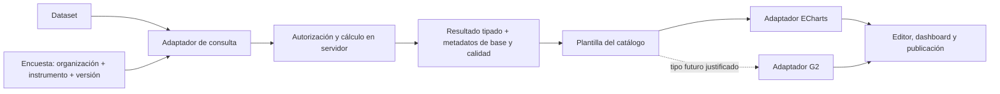

# Gráficas v2: alcance y arquitectura propuesta

**Estado:** especificación de producto y arquitectura, actualizada el 2026-10-06. Las decisiones proceden de la [entrevista](ENTREVISTA_GRAFICAS_V2.md). Parte del diseño ya se implementó; para distinguir lo aplicado de lo pendiente, consulta [MAPA_MODULOS.md](MAPA_MODULOS.md), [ARQUITECTURA_BBDD.md](ARQUITECTURA_BBDD.md) y el [mapa de Encuestas](MAPA_DATOS_ENCUESTAS.md).

## Decisión sobre motores y catálogo

**Propuesta:** usar **Apache ECharts 6** como primer motor de Gráficas v2. Ya está instalado (`echarts` 6.1.0 y `echarts-for-react` 3.0.6) y el renderizador v1 lo utiliza. Sus [importaciones modulares](https://echarts.apache.org/handbook/en/basics/import/) y [series personalizadas registrables](https://echarts.apache.org/handbook/en/how-to/custom-series/) permiten ampliar los tipos sin que cada gráfica importe toda la biblioteca. Es una inferencia de arquitectura basada en la documentación del motor y el código actual; el peso real del bundle se medirá durante la implementación.

**G2** se mantiene como posible segundo adaptador, no como dependencia inmediata. Su modelo de [marcas y canales](https://g2.antv.antgroup.com/en/manual/core/mark/overview), [transformaciones](https://g2.antv.antgroup.com/en/manual/core/transform/overview) y [boxplot](https://g2.antv.antgroup.com/en/manual/core/mark/boxplot) es atractivo para visualización estadística. Se incorporará cuando un tipo concreto aporte una ventaja comprobable frente a ECharts y se hayan comparado interacción, exportación, accesibilidad, rendimiento y mantenimiento en el mismo conjunto de datos. Añadirlo ahora duplicaría motores y adaptadores antes de necesitarlo.

[D3.js](https://d3js.org/) queda como candidato futuro para geometrías o interacciones hechas a medida. Su incorporación se decidirá por un caso de visualización concreto y no como sustituto obligatorio del motor inicial; está registrado en [PENDIENTES.md](PENDIENTES.md).

La «biblioteca de gráficas» es un **catálogo propio de plantillas y capacidades**, separado del motor gráfico. Los ejemplos de ECharts o G2 sirven de inspiración, pero no se cargarán opciones ni código remoto como configuraciones ejecutables de usuarios. El catálogo mostrará solo los tipos implementados, aunque su contrato permita ampliar decenas o cientos de plantillas sin rediseñar el editor.

## Contrato funcional de la primera entrega

| Área | Regla |
| --- | --- |
| Fuentes | Datasets y Encuestas en un mismo módulo y catálogo de gráficas guardadas. Conservar los tipos y capacidades v1 verificadas al migrar cada flujo. |
| Encuesta | Seleccionar un instrumento y una sola versión por gráfica; al crear, proponer la versión más reciente. Guardar la versión concreta para que el resultado no cambie silenciosamente cuando aparezca otra. |
| Análisis | Distribución de una pregunta, cruce de dos preguntas, y resumen de una variable numérica por grupo: conteo, porcentaje, promedio, mediana, suma, mínimo y máximo. |
| Tipos avanzados | Dispersión de dos variables numéricas, histograma de una numérica y boxplot de una numérica por grupo. Se agregan a KPI, barras, línea, área, pastel, tabla y mapa donde los datos cumplan los requisitos del tipo. |
| Selección múltiple | Alternar porcentaje de observaciones/personas que seleccionaron la opción y porcentaje del total de selecciones. Mostrar el denominador y permitir que los porcentajes por persona sumen más de 100 %. |
| Ponderación | Alternar resultados ponderados y sin ponderar, mostrando siempre el modo. El conteo de observaciones sin ponderar y la base ponderada deben distinguirse. |
| Calidad y ausencia | Incluir observaciones parciales/inválidas, valores ausentes, «No sabe/No contesta», advertencias de calidad y preguntas sin respuesta como categorías o estados identificados; permitir excluirlos mediante filtros. La fuente debe conservar la distinción entre ausencia de respuesta, opción marcada como ausente y advertencia de calidad. |
| Filtros | Ofrecer los campos válidos del instrumento/versión seleccionado y filtros de contexto/estado; acotar cruces por la misma observación y organización. |
| Personalización | Ejes, etiquetas, colores, leyendas, series, orden, escala y formatos según las capacidades declaradas por cada tipo. Editor de área de trabajo con herramientas/filtros a la izquierda y lienzo a la derecha. |
| Acceso | Gráfica guardada privada para el creador salvo publicación explícita. La lectura autenticada verifica pertenencia a la organización, permiso sobre la fuente e instrumento y autorización sobre la gráfica. Publicar solo el resultado agregado autorizado; no se exige mínimo de observaciones por celda. |

**Valores iniciales propuestos para el editor:** sin ponderar y porcentaje de observaciones en selección múltiple. Son valores de arranque de interfaz, no prohibiciones de los otros modos. Cuando el usuario cambie cualquiera, guardar esa elección en la gráfica y mostrarla en título/leyenda/tooltip o nota metodológica. Para cualquier porcentaje, mostrar numerador y denominador exactos tras filtros; para valores ausentes, dejar visible si pertenecen a la base. El denominador preciso de distribuciones y cruces debe ser una opción explícita del contrato de consulta, no una consecuencia accidental del join.

## Límite entre datos y visualización

1. **Definición canónica versionada de gráfica.** Guardar referencia de fuente (`dataset` o `survey`), identidad de organización, versión de instrumento si aplica, consulta analítica (población, dimensiones, medidas, agregación, filtros, ponderación, política de ausentes y base porcentual), plantilla y versión, asignación de canales (`x`, `y`, color, tamaño, facetas donde apliquen) y estilo permitido. No persistir `EChartsOption` ni una especificación G2 como contrato de negocio. Conservar las capacidades de v1 para contenido nuevo; no se requiere migrar registros históricos.
2. **Consultas por fuente.** El adaptador de dataset interpreta columnas; el de Encuestas resuelve variables, opciones, observaciones y selecciones por `organization_id` e `instrument_version_id`. La unidad de conteo de personas/registros es `survey_observations.id`, no el número de respuestas o selecciones. Los cruces se alinean por observación y deben evitar la multiplicación accidental de filas. No usar la tabla paginada de Encuestas ni el tope v1 de 5,000 filas para calcular estadísticas completas.
3. **Resultados tipados.** La consulta devuelve series/categorías, puntos XY, intervalos de histograma o resumen de caja (mínimo, Q1, mediana, Q3, máximo y atípicos según la regla estadística que se defina), junto con metadatos: base, conteo de observaciones, ponderación, filtros, estados de calidad y fecha de cálculo. Calcular bins, cuantiles, ponderación y denominadores en el servidor para que exportación y publicación reproduzcan el mismo resultado. Las [transformaciones de ECharts](https://echarts.apache.org/handbook/en/concepts/data-transform/) o de [G2](https://g2.antv.antgroup.com/en/manual/core/transform/overview) se reservan para presentación sobre ese resultado y no para definir la semántica de Encuestas.
4. **Catálogo declarativo de tipos.** Cada entrada tendrá ID y versión estables, nombre, forma de datos admitida, requisitos de campos, canales disponibles, controles visuales, adaptador de render, compatibilidad de exportación y vista previa. El editor genera sus controles desde estas capacidades; el servidor valida de nuevo la definición antes de consultar o guardar. Una plantilla nueva agrega su descriptor y compilador, sin ramificar todo el editor por `type`.
5. **Render y publicación compartidos.** El mismo contrato de resultado y compilación alimenta editor, detalle, dashboard, exportación y snapshot público. La publicación exige consentimiento explícito y conserva la definición/metodología del resultado; el snapshot debe indicar la versión y momento de cálculo. El acceso a fuente se comprueba antes de crear o refrescar un snapshot, nunca confiando en IDs enviados por el navegador.

## Tipos iniciales avanzados

| Plantilla | Entradas | Cálculo central | Motor inicial |
| --- | --- | --- | --- |
| Dispersión | Dos medidas numéricas; color/tamaño/grupo opcionales | Un punto por observación elegible o agregado explícito, con exclusión de pares inválidos visible | Serie scatter de ECharts |
| Histograma | Una medida numérica y regla de intervalos | Bordes, frecuencia y base calculados en servidor; modo ponderado configurable | Barras de ECharts con intervalos numéricos |
| Boxplot | Una medida numérica y grupo opcional | Cuantiles y regla de atípicos definida y documentada, calculados en servidor | Serie boxplot de ECharts |

La ponderación en gráficos estadísticos requiere definir su estimador: promedio y distribución ponderados son directos; mediana/cuantiles ponderados y atípicos dependen de una convención. Antes de implementar boxplot ponderado se documentará una regla única y se mostrará en la metodología. Si no se puede sostener una interpretación válida de algún tipo, el editor debe indicar la limitación al elegir el modo, sin producir una figura engañosa.

## Secuencia de implementación y puntos de verificación

1. Introducir definición canónica, validación y catálogo; adaptar las gráficas de datasets v1 y sus consumidores (detalle, dashboards, publicación y exportación). Mantener una ruta de lectura para configuraciones antiguas durante la migración.
2. Crear el servicio de consultas agregadas de Encuestas con autorización por organización/instrumento y resultados tipados. Respetar la versión fijada, ausentes, selección múltiple y ponderación.
3. Añadir los tres tipos avanzados y el editor de área de trabajo, con capacidades declaradas por plantilla y carga modular del motor. Evaluar tamaño del bundle y rendimiento con cardinalidades realistas.
4. Migrar guardado, privacidad y publicación; revisar también los consumidores de dashboards y enlaces públicos. Las tablas `charts`, sus políticas y el estado aplicado actual deben inspeccionarse antes de escribir SQL. Actualizar [ARQUITECTURA_BBDD.md](ARQUITECTURA_BBDD.md) tras verificar cualquier migración.

**Estado implementado al 2026-10-06:** el código nuevo guarda gráficas privadas por creador y organización en `insight_core`, calcula Encuestas desde la versión fijada, ofrece los tres tipos avanzados en ambas fuentes, carga datasets planos y mapas, permite anotaciones, exporta y crea snapshots públicos explícitos. Cada gráfica de Encuestas admite hasta cuatro filtros simultáneos de respuesta; las definiciones anteriores con un filtro siguen siendo legibles. Los archivos CSV/TSV/TXT y GeoJSON se limitan a 4 MB por petición para quedar bajo el [límite de 4.5 MB de Vercel Functions](https://vercel.com/docs/functions/limitations). Dashboards v2 pueden reunir ambas fuentes y guardar un layout arrastrable. El dashboard privado permite filtrar datasets por campo y recalcular las gráficas de una misma versión de Encuestas por una opción categórica, combinándola con los filtros propios de cada gráfica; los enlaces públicos son snapshots fijos. La implementación actual de análisis lee del servidor las observaciones y las respuestas de las variables seleccionadas antes de agruparlas; todavía no usa agregaciones SQL especializadas para grandes cardinalidades. Las gráficas planas y sus snapshots conservan el límite de 5,000 filas del flujo v1. Los orígenes SQL y conectores de Datasets v1 tampoco se han migrado al PostgreSQL actual. Consulta el mapa para rutas exactas y la arquitectura para migraciones verificadas.
