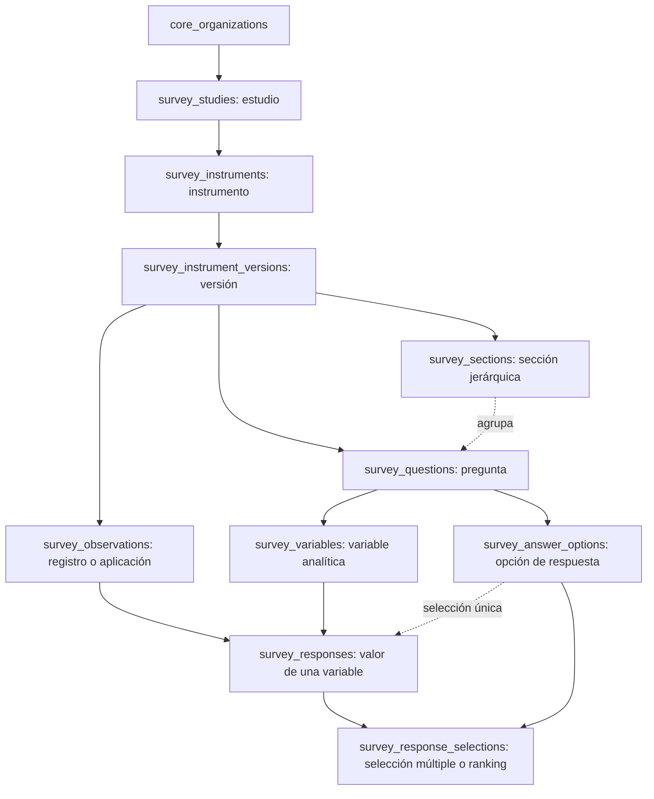

# Mapa de datos de Encuestas para análisis y Gráficas v2

Este mapa describe el modelo **implementado** de `insight_survey`, no el ejemplo conceptual `survey_surveys` de `ARQUITECTURA_BBDD.md` §18. Se contrastó con `scripts/001_initial_base_survey.sql`, `scripts/005_survey_organization_id.sql`, `scripts/survey-import-processor.js` y `src/lib/insight-surveys.ts`. El estado aplicado de las migraciones se documenta en `ARQUITECTURA_BBDD.md`; este mapa no sustituye una inspección de la base antes de modificar SQL.

## Relaciones y granularidad

| Entidad | Clave de relación | Qué representa |
| --- | --- | --- |
| `survey_studies` | `id` | Agrupa instrumentos de un estudio. |
| `survey_instruments` | `study_id` | Encuesta o instrumento conceptual; es el recurso `survey` que controla IAM. |
| `survey_instrument_versions` | `instrument_id` | Cuestionario y conjunto de registros de una versión concreta. |
| `survey_sections` | `instrument_version_id`, `parent_section_id` | Organización jerárquica del cuestionario. |
| `survey_questions` | `instrument_version_id`, `section_id` | Pregunta visible; su texto, código y tipo pertenecen a una versión. |
| `survey_variables` | `question_id` | Campo analítico; una pregunta puede producir varias variables. Incluye tipo de dato, nivel de medición y `is_analysis_variable`. |
| `survey_answer_options` | `question_id` | Código, valor, etiqueta, orden y marca de valor ausente para una pregunta. |
| `survey_observations` | `instrument_version_id` | Unidad de análisis o registro; incluye `external_id`, estado, fechas, `weight` y `context`. |
| `survey_responses` | `observation_id`, `variable_id` | Valor de una variable para una observación. Hay unicidad por ese par. Conserva `raw_value`, valores tipados, `answer_option_id`, ausencia y estado de calidad. |
| `survey_response_selections` | `response_id`, `answer_option_id` | Opciones de selección múltiple o ranking, con rango opcional. |

Las once tablas anteriores llevan `organization_id` obligatorio, FK a `insight_core.core_organizations` e índice propio desde la migración `005`. Las FK padre-hijo originales enlazan por ID; no existe una cadena de FK compuestas por `(organization_id, id)`. Las consultas de aplicación deben acotar y unir por organización además de validar la pertenencia de cada ID.

## Lectura para gráficas

- La **unidad base** para contar personas o registros es `survey_observations.id`, dentro de una versión. Contar filas de `survey_responses` mide respuestas o variables, no observaciones; contar `survey_response_selections` mide selecciones. Un cruce de dos preguntas debe alinearse por `observation_id` y controlar la multiplicación de filas si alguna pregunta tiene varias variables o selecciones.
- La dimensión elegida puede proceder de una variable, una opción de respuesta, el estado o contexto de la observación, o metadatos del cuestionario. No hay dos ejes fijos: primero se define versión, población, variable/dimensión, medida y reglas para ausentes, calidad y ponderación.
- Para selección única, `survey_responses.answer_option_id` enlaza a la opción de la pregunta. Para selección múltiple/ranking se usa `survey_response_selections`; no se debe inferir todo desde `raw_value`.
- `raw_value` preserva la entrada; `value_text`, `value_integer`, `value_decimal`, `value_boolean`, `value_date` y `value_datetime` son representaciones normalizadas. `is_missing`, `missing_type`, `quality_status` y `survey_answer_options.is_missing` condicionan los denominadores. `survey_observations.weight` existe, pero la UI actual de Encuestas no aplica ponderación a sus distribuciones.
- La consulta actual de «Por pregunta» en `getSurveyQuestionAnalytics` agrupa una pregunta y cuenta `distinct observation_id`, excluye `r.is_missing` para distribución, elige etiqueta con `coalesce(opción.label, value_text, raw_value)` y limita a 12 categorías. Eso sirve como referencia de comportamiento actual, no como motor suficiente para cruces multidimensionales o todas las opciones de una gráfica.
- La tabla de registros (`getSurveyTablePage`) arma una matriz solo para una **página** de observaciones y sus variables. Su máximo de 500 filas por página y la carga de datasets v1 de 5,000 filas impiden usarlas como fuente completa de análisis de encuestas. Las agregaciones de Gráficas v2 deberán ejecutarse en el servidor sobre el alcance autorizado y devolver resultados agregados.
- La importación reutilizable actual crea una pregunta y una variable por columna, opciones por pregunta, observaciones `completed` y respuestas por variable. El esquema admite más variables por pregunta y selecciones múltiples; el motor de gráficas debe basarse en el modelo, no en esa forma particular de importación.

## Acceso y consumidores existentes

`getSurveyDetail` valida usuario, catálogo `encuestas`, organización activa, `survey.access`, `survey.view` y acceso al recurso de instrumento antes de exponer versiones y preguntas. `listSurveys` sigue la misma frontera. Un lector nuevo para Gráficas debe volver a validar esa frontera por instrumento y organización antes de consultar con `insightDb()`, cuyo rol propietario puede omitir RLS. No basta con recibir `instrument_id` o `organization_id` desde el navegador.

Gráficas v1 guarda `charts.dataset_id` y obtiene filas con `fetchDatasetData`; dashboard y publicación repiten ese camino. La incorporación de Encuestas afecta también la carga de gráficas guardadas, dashboards y snapshots públicos. La autorización de publicación y la semántica de actualización de esos snapshots deberán definirse al diseñar Gráficas v2.
