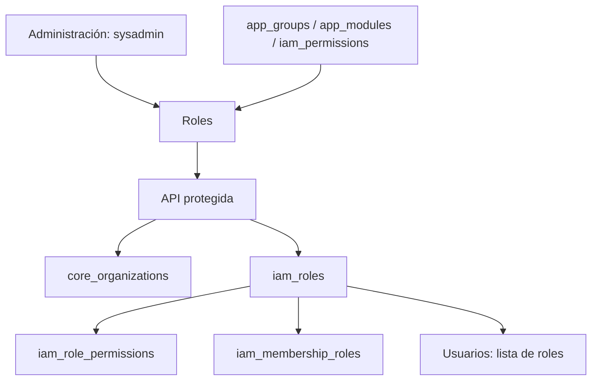
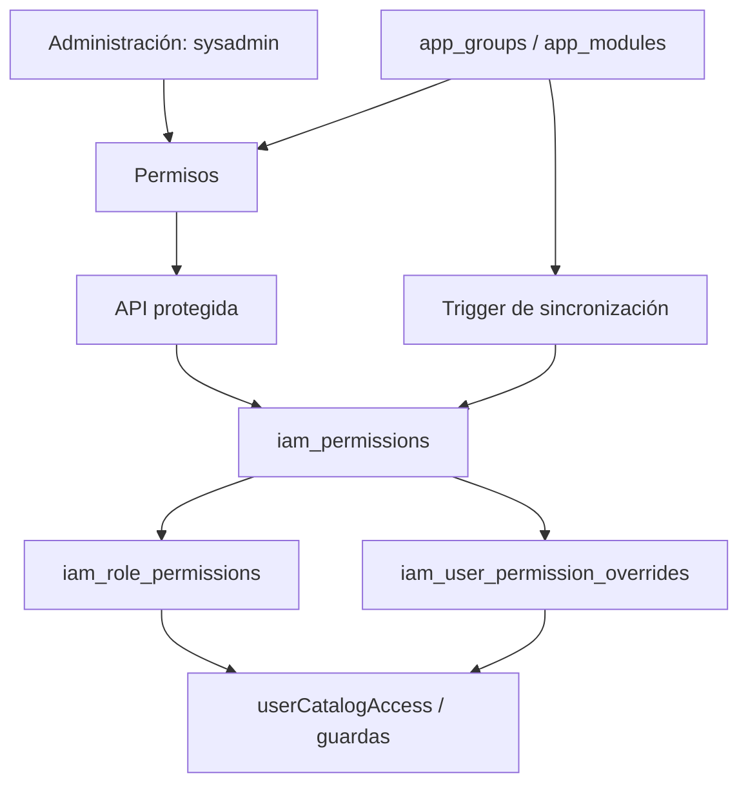
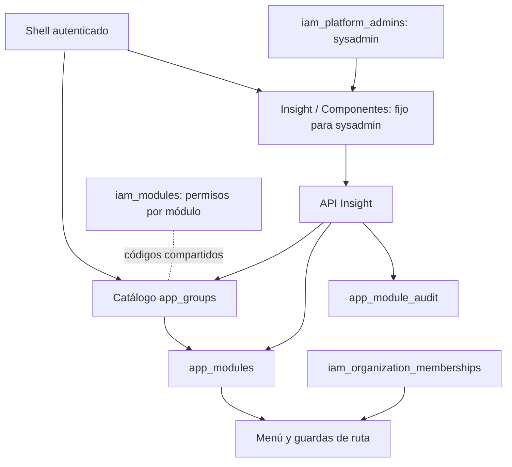
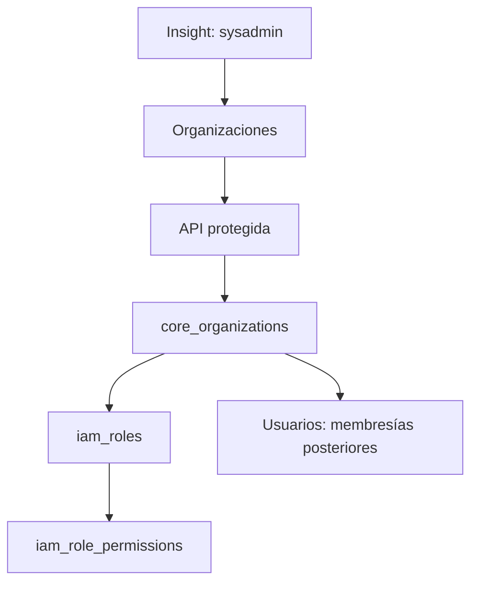
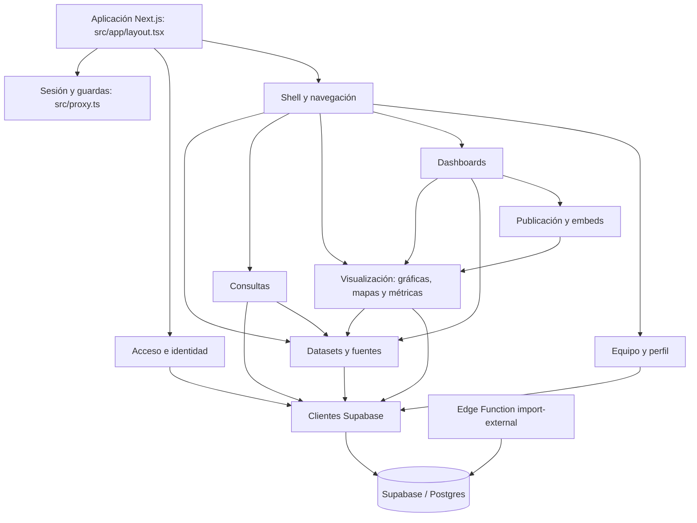
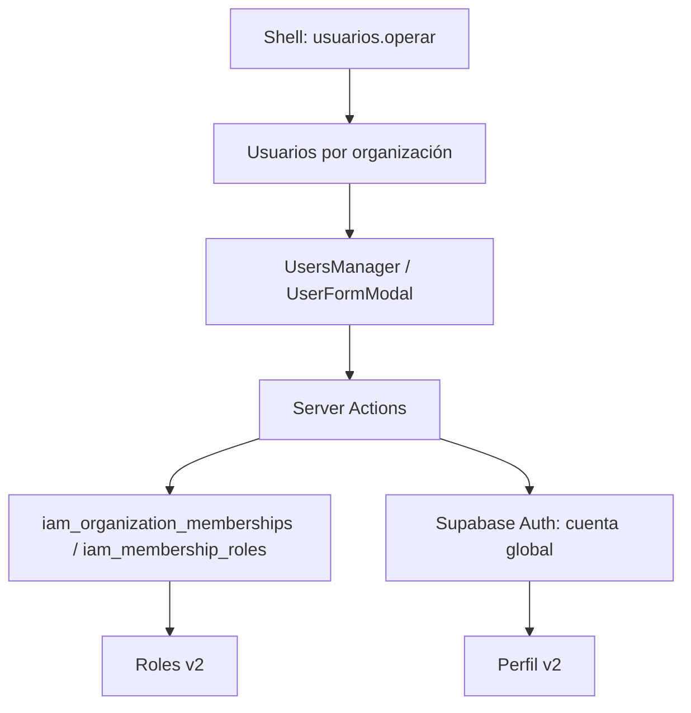
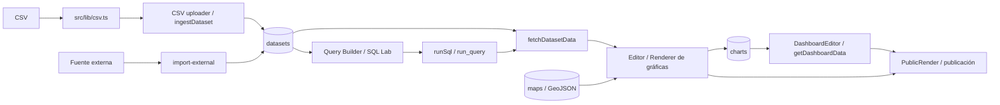

# Mapa de módulos — Intersel Insight

## Ver Como — v2

- **Descripción:** Sysadmin activa una máscara desde la fila de un miembro activo en Usuarios, dentro de la organización seleccionada. La sesión de Supabase y el actor de las operaciones siguen siendo Sysadmin; la máscara añade el contexto visible del miembro y sus accesos al catálogo, sin retirar las capacidades administrativas. Una banda delgada encima de la cabecera identifica al usuario y la organización y permite salir de la máscara.
- **Archivo principal:** `src/lib/view-as.ts` y `src/app/api/insight/view-as/route.ts`.
- **Archivos relacionados:** `src/components/insight/users-manager.tsx`, `src/components/insight/view-as-banner.tsx`, `src/app/(app)/team/page.tsx`, `src/app/(app)/surveys/page.tsx`, `src/components/insight/surveys-manager.tsx`, `src/app/(app)/layout.tsx`, `src/app/auth/signout/route.ts` y `src/lib/insight-catalog.ts`.
- **Funciones importantes:** `getViewedUser`, `POST/DELETE /api/insight/view-as`, `ViewAsBanner`.
- **Padres:** Usuarios y sesión autenticada de Sysadmin. La API valida la identidad real, la membresía activa y la organización activa en cada activación; el contexto se vuelve a validar al leerlo.
- **Hermanos/interacciones:** Usuarios y Encuestas seleccionan inicialmente la organización de la máscara; Sysadmin puede elegir las demás organizaciones que administra. Se conserva el aislamiento y la autorización de cada módulo con el actor real. Los módulos v1 aún usan `profiles`/`tenants`; esta máscara no los convierte en flujos v2 ni suplanta el JWT de Supabase.

## Roles de Administración — v2

- **Descripción:** gestión de roles por organización con listado, ordenación, búsqueda, lápiz de edición y papelera. El modal de alta/edición reúne nombre, descripción y permisos con grupos, filtros, módulos y resumen de cambios. `owner` es obligatorio y no se elimina; `sysadmin` es un rol global interno en `iam_platform_admins`, reservado fuera de este catálogo. Los demás roles requieren estar sin miembros ni concesiones de recursos para poder eliminarse.
- **Archivo principal:** `src/app/(app)/roles/page.tsx` y `src/components/insight/roles-manager.tsx`.
- **Archivos relacionados:** `src/components/insight/role-form-modal.tsx`, `src/components/insight/role-permission-workspace.tsx`, `src/app/api/insight/roles/route.ts`, `src/lib/insight-roles.ts`, `src/lib/catalog-code.ts`, `src/lib/insight-catalog.ts`, `src/lib/nav.ts` y `src/app/(app)/layout.tsx`.
- **Funciones importantes:** `listRoleWorkspace`, `saveInsightRole`, `deleteInsightRole`, `RolesManager`, `RoleFormModal`, `RolePermissionWorkspace`.
- **Padres:** layout autenticado `(app)` y navegación **Administración**; página y API requieren `sysadmin` y módulo `insight_roles` habilitado en el catálogo.
- **Hijos:** `insight_iam.iam_roles` pertenece a `insight_core.core_organizations`; `iam_role_permissions` asigna permisos y `iam_membership_roles` asigna roles a miembros.
- **Hermanos/interacciones:** lee `app_groups` → `app_modules` → `iam_permissions` para organizar el selector; Usuarios lee los roles de la organización para asignarlos. El modal edita datos y permisos en una transacción, también en roles predefinidos, y conserva permisos IAM anteriores ajenos al catálogo gestionable. La migración `scripts/017_single_sysadmin.sql` prohíbe el código `sysadmin` en `iam_roles`.

## Permisos de Administración — v2

- **Descripción:** catálogo de permisos por grupo y módulo, con totales, filtros heredados de selección múltiple, búsqueda expandible, edición de descripción y confirmación de eliminación. Los filtros Lucide cuentan selecciones y encadenan opciones disponibles grupo → módulo → acción; el buscador compacta los filtros a iconos. El alta despliega un formulario en la página y permite marcar varias acciones con botones del mismo estilo; solo ofrece las acciones aún libres `crear`, `editar`, `eliminar` y `exportar`. La API las inserta en una sola transacción. `operar` se provisiona automáticamente y no se elimina desde esta interfaz.
- **Archivo principal:** `src/app/(app)/permissions/page.tsx` y `src/components/insight/permissions-manager.tsx`.
- **Archivos relacionados:** `src/app/api/insight/permissions/route.ts`, `src/lib/insight-permissions.ts`, `src/lib/insight-catalog.ts`, `src/lib/nav.ts`, `scripts/016_catalog_operate_permissions.sql`, `src/components/navigation/confirm-dialog.tsx` y `src/components/insight/permission-filter-controls.tsx`.
- **Funciones importantes:** `listManagedPermissions`, `createManagedPermissions`, `updateManagedPermission`, `deleteManagedPermission`, `userCatalogAccess`, `PermissionsManager`.
- **Padres:** layout autenticado `(app)` y grupo de navegación **Administración**; la página y cada operación API exigen `sysadmin` y módulo `insight_permissions` habilitado en el catálogo.
- **Hijos:** `insight_iam.iam_modules` → `iam_permissions` → `iam_role_permissions` y `iam_user_permission_overrides`.
- **Hermanos/interacciones:** `app_groups` y `app_modules` dan la estructura visual; `iam_modules` comparte el código del módulo gestionable. `operar` se evalúa en el menú y en `requireCatalogAccess` con prioridad de la excepción individual sobre el rol. La concesión a roles existentes preserva la visibilidad inicial; nuevas acciones requieren asignación posterior para producir efectos de autorización.

## Componentes (catálogo Insight) — v2

- **Descripción:** administración sysadmin del catálogo de grupos y módulos. El formulario prioriza Nombre y deriva automáticamente un ID ASCII inmutable: espacios consecutivos se vuelven un guion bajo, las vocales con acento se pliegan a su letra y caracteres especiales como Š se descartan. El selector de íconos usa una cuadrícula visual y permite validar nombres adicionales de Lucide; el estado se elige en un campo select dentro del modal y `StateGauge` queda solo en la vista principal. El modal no edita orden ni los indicadores activo/visible.
- **Archivo principal:** `src/app/(app)/insight/modules/page.tsx` y `src/components/insight/catalog-manager.tsx`.
- **Archivos relacionados:** `src/components/insight/state-gauge.tsx`; `src/components/navigation/nav-icon.tsx`; `src/lib/catalog-code.ts`; catálogo local de `lucide-react/dynamic`; `src/app/api/insight/{groups,modules}/**/route.ts`; `src/lib/{insight-catalog,insight-catalog-api,insight-db}.ts/js`; `src/lib/nav.ts`; `scripts/{012_insight_module_catalog,013_insight_control_plane,014_catalog_groups_modules,015_remove_ready_state}.sql`.
- **Funciones importantes:** `currentSysadmin`, `listCatalog`, `userCatalogAccess`, `requireCatalogAccess`, `saveCatalog`, `catalogMutation`, `CatalogManager`, `StateGauge`.
- **Padres:** layout autenticado `(app)` y grupo fijo de navegación `Insight`; `iam_platform_admins` determina quién puede administrarlo. Su acceso no depende del catálogo.
- **Hijos:** `app_groups` → `app_modules`; las rutas implementadas se resuelven desde `NAV` y los módulos nuevos usan `/workspace/[code]` hasta que tengan página propia. `app_module_audit` registra cambios de grupos y módulos.
- **Hermanos/interacciones:** los módulos de rutas existentes consumen `requireCatalogAccess`; el shell combina navegación gestionable y el grupo fijo Insight. `iam_modules` agrupa permisos y comparte el código de los módulos gestionables. El trigger crea `operar` y lo concede a roles existentes en cada alta; el shell asigna `/workspace/[code]` a un módulo sin ruta implementada. `apagado` excluye incluso a `sysadmin` en los grupos y módulos gestionables. Roles y Permisos son gestionables, pero sus páginas y API siguen limitadas a sysadmin. Para los demás usuarios, las guardas exigen grupo y módulo disponibles y permiso `operar` por rol o excepción individual.

## Organizaciones de Insight — v2

- **Descripción:** directorio sysadmin de organizaciones, alta y edición de nombre, zona horaria y estado. El ID se deriva del nombre al crear y permanece fijo. El prefijo de código de tres caracteres se precarga desde el nombre y puede editarse durante el alta. Cada alta crea cinco roles base sin asignar a la cuenta maestra como miembro.
- **Archivo principal:** `src/app/(app)/insight/organizations/page.tsx` y `src/components/insight/organizations-manager.tsx`.
- **Archivos relacionados:** `src/app/api/insight/organizations/route.ts`, `src/lib/insight-organizations.ts`, `src/lib/survey-codes.ts`, `src/lib/catalog-code.ts`, `src/lib/insight-catalog.ts`, `src/lib/nav.ts`, `scripts/023_organization_prefix_survey_codes.sql` y `insight_core.core_organizations`.
- **Funciones importantes:** `listOrganizations`, `saveOrganization`, `OrganizationsManager`, `OrganizationDialog`.
- **Padres:** shell autenticado y grupo fijo Insight; página y API exigen `sysadmin`.
- **Hijos:** `core_organizations` → `iam_roles` → `iam_role_permissions`; las membresías se agregan después desde Usuarios.
- **Hermanos/interacciones:** Componentes gobierna las pantallas gestionables, mientras Organizaciones crea el ámbito de acceso que consumen Usuarios y Roles. La cuenta maestra permanece fuera de las membresías.

## Encuestas — v2

- **Descripción:** grupo propio **Encuestas** con un módulo del mismo nombre. La pantalla principal presenta las cargas sin completar con su estado y acciones para continuar o reintentar antes del catálogo de instrumentos, cuestionarios, versiones y respuestas por organización. La carga de TXT, CSV, XLSX, XLS, ODS o JSON valida el archivo sin diccionario, muestra vista previa y asignación de columnas, y arranca un Workflow duradero bajo demanda. El formulario acepta una versión entera iniciada en 1, muestra códigos de solo lectura que se forman al escribir los nombres y genera los folios definitivos al preparar la carga; el backend conserva la versión completa con subversión. Los archivos A y B de HCV 2025 se importaron previamente mediante una tarea puntual reproducible.
- **Archivo principal:** `src/app/(app)/surveys/page.tsx`, `src/app/(app)/surveys/[id]/page.tsx`, `src/app/(app)/surveys/[id]/responses/page.tsx` y `src/app/(app)/surveys/imports/page.tsx`.
- **Archivos relacionados:** `src/app/api/surveys/imports/route.ts`, `src/workflows/survey-import.ts`, `src/app/(app)/surveys/layout.tsx`, `src/components/insight/{surveys-manager,survey-detail-view,survey-imports-view}.tsx`, `src/lib/{insight-surveys,insight-survey-imports,survey-codes}.ts`, `src/lib/nav.ts`, `scripts/{020_survey_catalog,021_survey_import_jobs,022_serverless_survey_imports,023_organization_prefix_survey_codes}.sql`, `scripts/{survey-file,survey-import-processor,import-hcv-2025,generate-survey-fixture,verify-survey-fixture}.js`, [`docs/IMPORTAR_ENCUESTAS.md`](IMPORTAR_ENCUESTAS.md), [`docs/MANUAL_TECNICO_CARGA_ENCUESTAS.md`](MANUAL_TECNICO_CARGA_ENCUESTAS.md), [`docs/ENCUESTAS_HCV_2025.md`](ENCUESTAS_HCV_2025.md), [`MATRIZ_PRUEBAS_ENCUESTAS.md`](../MATRIZ_PRUEBAS_ENCUESTAS.md) y los seis archivos `encuesta_sintetica_20p_100r.*` de la raíz.
- **Funciones importantes:** `listSurveys`, `getSurveyDetail`, `getSurveyResponsePage`, `getSurveyImportWorkspace`, `listUnfinishedSurveyImports`, `createSurveyImportUpload`, `validateSurveyImportUpload`, `queueSurveyImportJob`, `surveyImportWorkflow`, `parseSurveyFile`, `SurveysManager`, `SurveyDetailView`, `SurveyImportsView`.
- **Padres:** shell autenticado, grupo gestionable `encuestas`, permiso `encuestas.operar`, organización activa y permisos `survey.access` + `survey.view`.
- **Hijos:** estudio → instrumento (la encuesta visible) → versiones → secciones/preguntas/opciones → observaciones y respuestas. `survey_import_jobs` conserva la versión, ruta privada del archivo, huella, vista previa, creador y estado; `survey_import_job_chunks` registra el progreso. `survey_code_sequences` reserva folios globales por organización de forma independiente para estudio e instrumento. Los conteos y registros proceden de la versión vigente.
- **Hermanos/interacciones:** `insight_iam.iam_resources` puede restringir el instrumento mediante `resource_type='survey'` y `domain_resource_id` igual al UUID del instrumento. El servicio filtra lista, detalle y respuestas por organización y recurso. La carga exige `survey.access` + `survey.create` en una organización activa; Supabase Storage recibe el archivo directo del navegador y Workflow de Vercel procesa bloques con `insight_app`, conserva `raw_value` y procedencia y publica solo al finalizar. Reutiliza por nombre el estudio y el instrumento, conserva sus códigos y rechaza una versión ya existente para ese par en la organización; la respuesta enlaza la encuesta o tarea existente y sugiere la siguiente versión entera. El importador HCV original conserva su remapeo especial de 17 columnas; el cargador general permite reasignación explícita de columnas.

## Área provisional de módulos — v2

- **Descripción:** destino automático del menú para módulos del catálogo sin ruta implementada. Muestra nombre, descripción y aviso de construcción; exige el mismo acceso de catálogo que la página final.
- **Archivo principal:** `src/app/(app)/workspace/[code]/page.tsx`.
- **Archivos relacionados:** `src/app/(app)/layout.tsx`, `src/lib/nav.ts`, `src/lib/insight-catalog.ts`, `src/lib/insight-db.js`, `src/components/navigation/nav-icon.tsx` y `scripts/018_managed_admin_modules.sql`.
- **Funciones importantes:** `ModuleWorkspace`, `userCatalogAccess`, `requireCatalogAccess`.
- **Padres:** grupo y módulo de `app_groups`/`app_modules`, shell y permiso `<code>.operar`.
- **Hijos:** tarjeta provisional; la ruta definitiva sustituye este destino al registrarse en `NAV`.
- **Hermanos/interacciones:** el trigger de catálogo crea el permiso y su asignación inicial; el shell genera el enlace provisional cuando no encuentra un código en `NAV`.

> **Estado:** inventario actualizado con la integración del catálogo y Organizaciones. El modelo objetivo de organización se documenta en [`ARQUITECTURA_BBDD.md`](../ARQUITECTURA_BBDD.md).
> **Propósito:** ubicar procesos, archivos y dependencias antes de modificar la aplicación, sin tener que recorrer todo el repositorio en cada tarea.

## Autoridad y alcance

Este mapa separa **estado implementado** de **modelo objetivo**. El código y sus imports describen el estado actual; `ARQUITECTURA_BBDD.md` es la referencia designada para el modelo objetivo de datos y organización. Los demás documentos Markdown preexistentes son **referencias no verificadas** hasta contrastarlos.

**Modelo objetivo:** Intersel Insight será multi-organización, no multitenant. Una instalación equivale a un deployment y puede contener varias organizaciones. Los usuarios son globales a la instalación y acceden a los datos de cada organización por su membership, roles y permisos; `organization_id` es el ámbito de pertenencia y aislamiento de los datos. No se agrega `installation_id`.

**Brecha observada:** el código actual aún consulta `profiles`, `tenants` y `tenant_id` en módulos como autenticación, datasets, gráficas y dashboards. Esto describe la implementación presente, no el modelo objetivo; cualquier refactor de esas áreas debe considerar tanto el flujo actual como su destino multi-organización.

**Base aplicada:** `auth` pertenece a Supabase; las tablas propias están en `insight_core` (6), `insight_iam` (10) e `insight_survey` (12). El catálogo de módulos ya se aplicó, aunque la mayor parte de la app sigue siendo v1. Consulta «Estado aplicado» en `ARQUITECTURA_BBDD.md` antes de modificar SQL, permisos o RPC.

## Estado de versión de los archivos de aplicación

Los archivos de aplicación descritos en este mapa se consideran **v1** mientras no tengan una etiqueta explícita de v2. **Perfil**, **Componentes**, **Permisos**, **Roles**, **Usuarios** y **Organizaciones** son v2. La carpeta hermana `../intersel-insight` es la primera versión y se consulta solo para comparación.

| Versión | Archivos |
|---|---|
| **v1** | `src/app/**` excepto Perfil, `src/app/(app)/insight/**`, `src/app/(app)/workspace/**`, `src/app/(app)/permissions/**`, `src/app/(app)/roles/**`, `src/app/(app)/team/**` y `src/app/api/insight/**`; `src/components/**` excepto avatar y `src/components/insight/**`; `src/lib/**` excepto `src/lib/insight-*`; `src/proxy.ts`; Edge Function `supabase/functions/import-external/index.ts`. Las guardas nuevas `layout.tsx` en rutas existentes no migran el resto de esos flujos. |
| **v2** | Perfil: `src/app/(app)/profile/{page.tsx,actions.ts,name-avatar-form.tsx,password-form.tsx}` y `src/components/avatar-cropper.tsx`. Administrador Insight: `src/app/(app)/insight/modules/page.tsx`, `src/components/insight/catalog-manager.tsx`. Organizaciones: `src/app/(app)/insight/organizations/page.tsx`, `src/components/insight/organizations-manager.tsx`. Encuestas (consulta inicial): `src/app/(app)/surveys/**`, `src/components/insight/{surveys-manager,survey-detail-view}.tsx` y `src/lib/insight-surveys.ts`. Área provisional: `src/app/(app)/workspace/[code]/page.tsx`. Permisos: `src/app/(app)/permissions/page.tsx`, `src/components/insight/permissions-manager.tsx`. Roles: `src/app/(app)/roles/page.tsx`, `src/components/insight/roles-manager.tsx`. Usuarios: `src/app/(app)/team/{page.tsx,actions.ts,layout.tsx}`, `src/components/insight/{users-manager,user-form-modal}.tsx`, `src/lib/insight-users.ts`. API `src/app/api/insight/**` y servicios `src/lib/insight-*`. |

Esta marca expresa el linaje/estado acordado, no la compatibilidad con el esquema objetivo. Un archivo v1 puede requerir migración a organizaciones. Cambia una marca a v2 solo cuando ese flujo se haya adaptado y verificado; conserva el registro de módulos pendientes en este mapa.

Las relaciones marcadas **directas** se observan en imports o composición de componentes. Las marcadas **flujo** representan una relación funcional visible entre archivos aunque no exista un import directo. Este documento es un índice de navegación, no reemplaza la lectura de la función que se vaya a cambiar.

## Vista general

## Catálogo de módulos

### 1. Aplicación y rutas — v1

- **Descripción:** composición raíz, metadatos y páginas por URL. Usa App Router; los grupos entre paréntesis organizan archivos sin formar parte de la URL.
- **Archivo principal:** `src/app/layout.tsx` y `src/app/page.tsx`.
- **Archivos relacionados:** `src/app/globals.css`; `src/app/(app)/layout.tsx`; `src/app/(app)/loading.tsx`; archivos `page.tsx`, `actions.ts` y `route.ts` bajo `src/app/`.
- **Funciones importantes:** `RootLayout`, `Home`, `AppLayout` y las funciones exportadas por cada `actions.ts`.
- **Padres:** raíz del árbol de rutas de Next.js.
- **Hijos:** rutas públicas/de acceso, rutas del panel `(app)`, rutas públicas de publicación `/p/[token]` y manejadores `/auth/*`.
- **Hermanos/interacciones:** Proxy de sesión (aplica antes de atender las rutas); módulos de acceso y shell.

### 2. Sesión, autenticación y acceso — v1

- **Descripción:** refresca la sesión, limita navegación sin usuario, gestiona login/logout, confirmación, invitaciones y contraseña temporal.
- **Archivo principal:** `src/proxy.ts` → `src/lib/supabase/proxy.ts` (`updateSession`).
- **Archivos relacionados:** `src/app/login/{page,actions}.tsx`; `src/app/auth/{confirm,signout}/route.ts`; `src/app/join/[token]/{page,actions}.tsx`; `src/app/onboarding/{page,actions}.tsx`; `src/app/change-password/{page,actions}.tsx`; `src/app/solicitar-acceso/page.tsx`; `src/lib/auth.ts`; `src/lib/supabase/{server,admin}.ts`.
- **Funciones importantes:** `updateSession`, `getProfileContext`, `login`, `acceptInvite`, `createFirstOrganization`, `changePassword`; manejadores `GET` y `POST` en rutas de autenticación.
- **Padres:** Proxy raíz y router de la aplicación.
- **Hijos:** páginas de login, onboarding, invitación, contraseña, perfil y las rutas protegidas.
- **Hermanos/interacciones:** shell autenticado consume `getProfileContext`; perfil y administración de usuarios realizan cambios mediante Server Actions y Supabase.
- **Estado actual / dependencia sensible:** `src/lib/auth.ts` consulta `profiles` y `tenants`, devuelve roles `admin | editor | viewer` y `can_publish`. Es un contrato de implementación basado en tenant; el objetivo es usuario global + memberships por organización + roles/permisos. Confirmar contratos concretos antes de tocar autorización.

### 3. Shell, navegación y preferencias de interfaz — v1

- **Descripción:** marco visual del área autenticada, navegación desktop/móvil, encabezado, cuenta, tema, carga y recarga.
- **Archivo principal:** `src/app/(app)/layout.tsx`.
- **Archivos relacionados:** `src/lib/nav.ts`; todos los componentes de `src/components/navigation/`; `src/components/cube-loader.tsx`; `src/components/auto-refresh.tsx`.
- **Funciones/componentes importantes:** `AppLayout`, `NAV`, `findActiveNav`, `Sidebar`, `PanelHeader` (selector de módulos del header en todos los grupos, incluidos los de un solo módulo), `MobileModulesDrawer`, `MobileModuleBar`, `PanelHeaderProvider`, `MobileNavProvider`, `SessionAccountFooter`, `ThemeToggle`. `src/app/globals.css` define los tokens semánticos de color y las clases compartidas `.insight-card-header`, `.insight-shell-chrome` y `.insight-sidebar-surface`.
- **Padres:** layout raíz y contexto de sesión.
- **Hijos:** módulos accesibles desde el menú: Fuentes, Datasets, SQL Lab, Métricas, Encuestas, Dashboards, Gráficas, Mapas, Temas y Usuarios. Perfil y Consulta se declaran rutas adicionales en `src/lib/nav.ts`.
- **Hermanos/interacciones:** todos los módulos de panel comparten este shell; `findActiveNav` determina título/grupo según ruta.

### 4. Datasets e ingestión — v1

- **Descripción:** lista y detalle de datasets, carga CSV y aplicación de filtros por fila al obtener datos.
- **Archivo principal:** `src/lib/datasets.ts` (`fetchDatasetData`) para lectura; `src/app/(app)/datasets/new/actions.ts` (`ingestDataset`) para ingestión.
- **Archivos relacionados:** `src/app/(app)/datasets/{page.tsx,[id]/page.tsx,policy-actions.ts,new/page.tsx,new/actions.ts}`; `src/components/csv-uploader.tsx`; `src/components/row-policy-manager.tsx`; `src/lib/csv.ts`; `src/lib/supabase/server.ts`.
- **Funciones importantes:** `fetchDatasetData`, `buildRowFilter`, `sanitizeKey`, `inferType`, `buildTable`, `ingestDataset`.
- **Padres:** shell para UI; Supabase para persistencia.
- **Hijos:** carga CSV, detalle, reglas de acceso por fila y consumo de datos por consultas, gráficas y dashboards.
- **Hermanos/interacciones:** SQL Lab y constructor de consulta leen datasets; visualización los convierte en filas/columnas. Fuentes externas materializan datos en este módulo.
- **Estado actual / entidades observadas:** `datasets`, `dataset_row_policies`, `query_cache`, RPC `run_query`; varias escrituras usan `tenant_id`. El objetivo es atribuir los datos privados a una organización mediante `organization_id` y aplicar el modelo de membresías/autorización descrito en `ARQUITECTURA_BBDD.md`.

### 5. Fuentes externas — v1

- **Descripción:** administración de conexiones externas y acción de importar su contenido hacia datasets.
- **Archivo principal:** `src/app/(app)/sources/page.tsx` y `src/app/(app)/sources/actions.ts`.
- **Archivos relacionados:** `src/components/external-sources.tsx`; `supabase/functions/import-external/index.ts`; `src/lib/supabase/server.ts`.
- **Funciones/componentes importantes:** `addExternalSource`, `deleteExternalSource`, `ExternalSources`, `SourceCard`; Edge Function contiene `sanitizeKey`, `inferType`, `hostLooksInternal`.
- **Padres:** shell, autenticación y Supabase.
- **Hijos:** gestión de fuentes y proceso Edge de importación.
- **Hermanos/interacciones:** la importación entrega datos al módulo Datasets; depende del almacenamiento/funciones de Supabase.

### 6. Consultas y SQL — v1

- **Descripción:** edición de consultas SQL, generación de SQL desde una interfaz visual, ejecución y guardado de consultas.
- **Archivo principal:** `src/app/(app)/sql/actions.ts` (ejecución/guardado) y `src/lib/query-builder.ts` (generación pura de SQL).
- **Archivos relacionados:** `src/app/(app)/sql/page.tsx`; `src/app/(app)/query/new/page.tsx`; `src/components/sql-lab.tsx`; `src/components/query-builder.tsx`; `src/lib/datasets.ts`; `src/lib/supabase/server.ts`.
- **Funciones importantes:** `runSql`, `saveSqlQuery`, `buildSql`, `SqlLab`, `QueryBuilder`.
- **Padres:** shell y Supabase.
- **Hijos:** editor SQL y constructor sin código.
- **Hermanos/interacciones:** consulta datasets y produce resultados que pueden guardarse como consultas/datasets y alimentar visualizaciones.
- **Dependencia sensible:** la acción de ejecución y los privilegios/RPC de base de datos definen el límite real de seguridad; revisar ambos antes de modificar SQL ejecutable.

### 7. Visualización: gráficas, mapas y métricas — v1

- **Descripción:** edición, render y persistencia de gráficas; mapas geográficos; métricas reutilizables.
- **Archivo principal:** `src/lib/charts.ts` para modelo y agregaciones; `src/components/chart-renderer.tsx` para renderizado.
- **Archivos relacionados:** `src/app/(app)/charts/{page.tsx,actions.ts,annotation-actions.ts,publish-actions.ts,new/page.tsx,[id]/page.tsx,[id]/edit/page.tsx}`; `src/components/{chart-editor,chart-renderer,annotations-panel,map-manager,metric-manager}.tsx`; `src/lib/{datasets,maps}.ts`; rutas `maps` y `metrics` en `src/app/(app)/`.
- **Funciones importantes:** `aggregateByCategory`, `computeKpi`, `buildEChartsOption`, `buildMapOption`, `fetchDatasetData`, `getGeoForConfig`, `saveChart`, `updateChart`, `addAnnotation`, `deleteAnnotation`, `createMetric`, `deleteMetric`.
- **Padres:** shell y datasets/Supabase.
- **Hijos:** editor, renderizador ECharts, anotaciones, catálogos de mapas y métricas.
- **Hermanos/interacciones:** dashboards incorporan gráficas; publicación expone gráficas y sus datos; datasets suministran las filas.
- **Entidades observadas:** `charts`, anotaciones y configuración de mapas; validar el esquema en la implementación antes de cambiarlo.

### 8. Dashboards — v1

- **Descripción:** lista, creación, edición y visualización de paneles que combinan gráficas, filtros y layouts.
- **Archivo principal:** `src/lib/dashboards.ts` (`getDashboardData`).
- **Archivos relacionados:** `src/app/(app)/dashboards/{page.tsx,actions.ts,publish-actions.ts,[id]/page.tsx,[id]/edit/page.tsx}`; `src/components/{dashboard-editor,dashboard-view,auto-refresh,publish-dialog}.tsx`; `src/lib/{charts,datasets,maps}.ts`.
- **Funciones/componentes importantes:** `getDashboardData`, `createDashboard`, `createDashboardAndEdit`, `saveDashboard`, acciones de publicación; `DashboardEditor`, `DashboardView`.
- **Padres:** shell y Supabase.
- **Hijos:** gráficas, filas de datos, filtros, layouts y diálogo de publicación.
- **Hermanos/interacciones:** consume módulos de datasets, visualización y mapas; comparte el flujo de publicación con Gráficas.
- **Entidades observadas:** `dashboards`, `dashboard_items`, `dashboard_filters`, `charts`.

### 9. Publicación y embeds — v1

- **Descripción:** configuración de publicación, vista externa por token, control opcional por contraseña, contadores y tarjeta social.
- **Archivo principal:** `src/app/p/[token]/page.tsx`.
- **Archivos relacionados:** `src/app/p/[token]/{actions.ts,opengraph-image.tsx}`; `src/app/(app)/charts/publish-actions.ts`; `src/app/(app)/dashboards/publish-actions.ts`; `src/components/{public-render,password-gate,publish-dialog}.tsx`; `src/lib/{dashboards,datasets,maps}.ts`.
- **Funciones/componentes importantes:** `generateMetadata`, `PublicPage`, acciones `publishChart`, `signEmbed`, `publishDashboard` y `getDashboardPublication`; `PublicRender`, `PasswordGate`, `PublishDialog`.
- **Padres:** publicación se inicia desde los módulos Gráficas o Dashboards; vista pública depende del router raíz y el Proxy.
- **Hijos:** render público, gate de contraseña y generación Open Graph.
- **Hermanos/interacciones:** comparte consultas de datos y renderizado con dashboards/gráficas. La ruta `/p/` es explícitamente pública según `updateSession`.

### 10. Usuarios y asignación de roles — v2

- **Descripción:** alta, búsqueda expandible, filtros multiselección encadenados por rol y estado, ordenación, estado, edición, retiro de membresía y reseteo de contraseña de usuarios por organización. Los filtros solo ofrecen opciones presentes en los miembros disponibles. La cuenta Auth es global; el retiro solo elimina la membresía. El rol `owner` activo no puede quedar sin titular. El `sysadmin` global queda fuera de la lista y de todas las acciones de Usuarios.
- **Archivo principal:** `src/app/(app)/team/page.tsx` y `src/components/insight/users-manager.tsx`.
- **Archivos relacionados:** `src/app/(app)/team/actions.ts`, `src/app/(app)/team/layout.tsx`; `src/components/insight/user-form-modal.tsx`; `src/lib/insight-users.ts`; `src/lib/supabase/{admin,server}.ts`; migración `scripts/017_single_sysadmin.sql`; RPC `list_invitable_orgs`, `list_org_members`, `list_org_roles`, `iam_has_permission`, `add_organization_member`.
- **Funciones importantes:** `listUserOrganizations`, `memberRoleIds`, `createUser`, `updateTeamMember`, `changeTeamMemberStatus`, `removeTeamMember`, `resetTeamMemberPassword`, `UsersManager`, `UserFormModal`.
- **Padres:** shell autenticado, guarda `usuarios.operar` del catálogo y permisos IAM `members.invite`, `members.update`, `members.remove`; el reseteo de contraseña global exige además `sysadmin`.
- **Hijos:** `auth.users` y `core_user_profiles` para identidad global; `iam_organization_memberships` y `iam_membership_roles` para acceso de cada organización.
- **Hermanos/interacciones:** Roles v2 define las opciones asignables. Perfil comparte la identidad global. Suspender o retirar una membresía afecta el acceso a esa organización y preserva las demás.

### 11. Perfil — v2

- **Descripción:** edición de nombre, avatar y contraseña de la cuenta autenticada.
- **Archivo principal:** `src/app/(app)/profile/page.tsx`.
- **Archivos relacionados:** `src/app/(app)/profile/{actions.ts,name-avatar-form.tsx,password-form.tsx}`; `src/components/avatar-cropper.tsx`; `src/lib/supabase/{server,admin}.ts`; `src/lib/nav.ts`.
- **Funciones/componentes importantes:** acciones de actualización de perfil y contraseña; `NameAvatarForm`, `PasswordForm`, `AvatarCropper`.
- **Padres:** shell autenticado y sesión del usuario.
- **Hijos:** formularios de nombre/avatar y contraseña.
- **Hermanos/interacciones:** Equipo administra membresías/usuarios; Perfil modifica datos de la propia cuenta. La primera versión `../intersel-insight` no contiene esta ruta.
- **Estado de versión:** v2, según indicación del usuario. Revisar sus contratos de persistencia/autenticación frente a organizaciones antes de extenderlos.

### 12. Servicios compartidos y utilidades — v1

- **Descripción:** adaptadores comunes para Supabase y funciones reutilizables sin UI.
- **Archivo principal:** `src/lib/supabase/server.ts` para operaciones de servidor.
- **Archivos relacionados:** `src/lib/supabase/{client,admin,proxy}.ts`; `src/lib/{auth,charts,csv,datasets,dashboards,maps,query-builder,export,nav,use-container-width}.ts`.
- **Funciones importantes:** fábricas `createClient` de servidor/cliente; `createAdminClient`; `getProfileContext`; transformadores CSV/SQL; agregaciones y constructores de opciones ECharts; `toCsv`, `downloadCsv`, `slugify`; `findActiveNav`, `useContainerWidth`.
- **Padres:** raíz de la aplicación; los módulos de dominio son consumidores.
- **Hijos:** clientes Supabase de servidor, navegador, administrador y proxy; utilidades puras y acceso a datos compartido.
- **Hermanos/interacciones:** las utilidades se comparten entre datasets, consultas, visualizaciones, dashboards, autenticación y publicación.
- **Precaución:** `admin.ts` usa `SUPABASE_SERVICE_ROLE_KEY` y debe permanecer en rutas de servidor autorizadas.

### 13. Base de datos y funciones Edge — v1/v2 mixto

- **Descripción:** persistencia y lógica delegada fuera de Next.js. Conviven SQL antiguo basado en tenant y scripts nuevos del modelo multi-organización; el número de versión se indica por archivo/módulo y no se deduce solo por la carpeta.
- **Archivos principales:** `supabase/functions/import-external/index.ts`; SQL bajo `scripts/` y `supabase/migrations/`.
- **Archivos relacionados:** `scripts/run-sql.js`, scripts SQL y de provisionamiento, pruebas SQL, clientes Supabase y RPC referenciados en `src/`.
- **Funciones importantes:** Edge Function `import-external`; RPCs llamados desde la aplicación (por ejemplo `run_query`; identificar otros buscando `.rpc(` en el código al trabajar un flujo).
- **Padres:** Supabase/Postgres externo a la aplicación Next.js.
- **Hijos:** esquemas, tablas, políticas, funciones SQL y almacenamiento.
- **Hermanos/interacciones:** módulos de dominio invocan Supabase mediante clientes compartidos; la Edge Function importa fuentes externas.
- **Confianza del inventario:** la presencia de un archivo SQL no confirma que esté aplicado ni vigente. No aplicar ni usar una migración como contrato sin verificar su consumidor y estado por separado.
- **Estado SQL confirmado (2026-09-29):** `auth` es de Supabase. `insight_app` es el rol SQL dedicado y propietario de 28 tablas propias: 6 en `insight_core`, 10 en `insight_iam`, 12 en `insight_survey`. El catálogo gestionable observado tras `020` tiene 5 grupos y 14 módulos; Insight está fuera. La base aún contiene el módulo provisional `organizacion` que `019` documenta como retirado. `platform`, `intersel_insight` y el schema vacío `survey` ya no existen. `scripts/run-sql.js` usa `APP_DATABASE_URL` por defecto y requiere `--admin` para la conexión `postgres`.
- **Dependencias inmediatas de base:** `auth.users` → perfiles, administradores y membresías; `insight_core.core_organizations` → membresías, roles, encuestas y concesiones de módulos; `private` → funciones de RLS; `public` → RPC consumidas por Next.js. Migraciones de encuestas hasta `scripts/023_organization_prefix_survey_codes.sql`; confirma el estado aplicado de cada una antes de reutilizarla. Los tres schemas propios no se exponen directamente por la Data API.

## Rutas identificadas

El grupo `(app)` no forma parte de las URLs públicas.

| URL | Archivo de entrada | Módulo | Versión |
|---|---|---|---|
| `/` | `src/app/page.tsx` | Entrada/redirección | v1 |
| `/login` | `src/app/login/page.tsx` | Acceso | v1 |
| `/auth/confirm` | `src/app/auth/confirm/route.ts` | Confirmación | v1 |
| `/auth/signout` | `src/app/auth/signout/route.ts` | Sesión | v1 |
| `/onboarding` | `src/app/onboarding/page.tsx` | Organización inicial | v1 |
| `/join/[token]` | `src/app/join/[token]/page.tsx` | Invitaciones | v1 |
| `/change-password` | `src/app/change-password/page.tsx` | Seguridad de cuenta | v1 |
| `/solicitar-acceso` | `src/app/solicitar-acceso/page.tsx` | Solicitud de acceso | v1 |
| `/p/[token]` | `src/app/p/[token]/page.tsx` | Publicación pública | v1 |
| `/dashboard` | `src/app/(app)/dashboard/page.tsx` | Inicio del panel | v1 |
| `/insight/modules` | `src/app/(app)/insight/modules/page.tsx` | Catálogo de grupos y módulos; solo sysadmin | v2 |
| `/insight/organizations` | `src/app/(app)/insight/organizations/page.tsx` | Organizaciones; solo sysadmin | v2 |
| `/roles` | `src/app/(app)/roles/page.tsx` | Roles por organización; solo sysadmin | v2 |
| `/permissions` | `src/app/(app)/permissions/page.tsx` | Permisos del catálogo; solo sysadmin | v2 |
| `/surveys` | `src/app/(app)/surveys/page.tsx` | Catálogo de encuestas por organización | v2 |
| `/surveys/[id]` | `src/app/(app)/surveys/[id]/page.tsx` | Cuestionario y versiones de un instrumento | v2 |
| `/surveys/[id]/responses` | `src/app/(app)/surveys/[id]/responses/page.tsx` | Registros paginados y respuestas individuales de la versión actual | v2 |
| `/surveys/imports` | `src/app/(app)/surveys/imports/page.tsx` | Validación, mapeo, confirmación y seguimiento de cargas en seis formatos | v2 |
| `/api/surveys/imports` | `src/app/api/surveys/imports/route.ts` | Autorizar subida privada, validar archivo e iniciar Workflow | v2 |
| `/workspace/[code]` | `src/app/(app)/workspace/[code]/page.tsx` | Módulos nuevos en construcción | v2 |
| `/sources` | `src/app/(app)/sources/page.tsx` | Fuentes | v1 |
| `/datasets`, `/datasets/new`, `/datasets/[id]` | `src/app/(app)/datasets/` | Datasets | v1 |
| `/sql` | `src/app/(app)/sql/page.tsx` | SQL Lab | v1 |
| `/query/new` | `src/app/(app)/query/new/page.tsx` | Constructor de consultas | v1 |
| `/metrics` | `src/app/(app)/metrics/page.tsx` | Métricas | v1 |
| `/charts`, `/charts/new`, `/charts/[id]`, `/charts/[id]/edit` | `src/app/(app)/charts/` | Gráficas | v1 |
| `/dashboards`, `/dashboards/[id]`, `/dashboards/[id]/edit` | `src/app/(app)/dashboards/` | Dashboards | v1 |
| `/maps` | `src/app/(app)/maps/page.tsx` | Mapas | v1 |
| `/themes` | `src/app/(app)/themes/page.tsx` | Temas | v1 |
| `/team` | `src/app/(app)/team/page.tsx` | Usuarios por organización | v2 |
| `/profile` | `src/app/(app)/profile/page.tsx` | Perfil | v2 |

## Relaciones inmediatas por flujo

| Cambio en… | Revisar inmediatamente… | Motivo |
|---|---|---|
| Sesión o autorización | `src/proxy.ts`, `src/lib/supabase/proxy.ts`, `src/lib/auth.ts`, Server Actions afectadas | Guardas, identidad y permisos se validan en más de una capa. |
| Columnas/ingestión de dataset | `src/lib/csv.ts`, `csv-uploader.tsx`, `datasets/new/actions.ts`, `fetchDatasetData`, RPC de ingestión | El nombre y tipo de columna fluyen a tabla física, consulta y visualización. |
| Ejecución SQL | `sql/actions.ts`, `query-builder.ts`, `datasets.ts`, RPC/función SQL consumida | Generación, límites, filtrado y permisos están repartidos. |
| Configuración de gráfica | `lib/charts.ts`, editor, renderer, acciones, vista pública | El mismo `ChartConfig` se crea, persiste y consume en varios contextos. |
| Layout o datos de dashboard | `lib/dashboards.ts`, editor, vista, acciones de dashboard y publicación | El servidor arma items/filtros/layout y el cliente los presenta/edita. |
| Embed/publicación | acciones de charts y dashboards, `/p/[token]`, `public-render.tsx`, Proxy | Configuración autenticada y render público son partes del mismo flujo. |
| Fuente externa | página/actions, componente, Edge Function, tablas y RPC de ingestión | La UI administra la fuente; la función realiza conexión e importación. |

## Contratos técnicos observados

- Framework declarado: Next.js `16.2.9`, App Router; React `19.2.4`; TypeScript. El archivo raíz `src/proxy.ts` exporta `proxy` y usa `src/lib/supabase/proxy.ts`.
- Persistencia/acceso: `@supabase/ssr` y `@supabase/supabase-js`; claves públicas para cliente y `SUPABASE_SERVICE_ROLE_KEY` para el cliente administrativo.
- Gráficas: ECharts a través de `echarts-for-react`; exportación usa `html2canvas-pro` y `jspdf` (confirmar consumidores con búsqueda de imports al cambiar esa área).
- Archivos de entrada importantes: `package.json`, `next.config.ts`, `tsconfig.json`, `src/app/layout.tsx`, `src/proxy.ts`.
- Contratos consultados directamente desde código incluyen `profiles`, `tenants`, `datasets`, `dataset_row_policies`, `query_cache`, `dashboards`, `dashboard_items`, `dashboard_filters`, `charts` y `maps`. Reflejan la implementación observada, no el modelo objetivo multi-organización, ni confirman el estado remoto de la base.

## Cómo mantener este mapa

1. Al agregar, quitar o mover una ruta/módulo, actualizar Catálogo y Rutas.
2. Al cambiar imports o composición entre módulos, actualizar los diagramas y las relaciones directas.
3. Al cambiar una acción de servidor, consulta, RPC, autorización o flujo de publicación, actualizar Contratos y la tabla de revisión inmediata.
4. Mantener la fecha de inspección en el encabezado. Si un comportamiento no se verificó en el código, etiquetarlo como pendiente de verificación en vez de copiarlo de documentación antigua.
