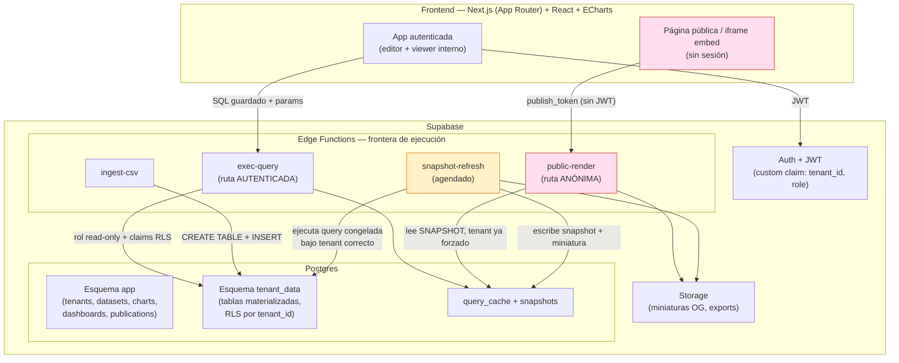
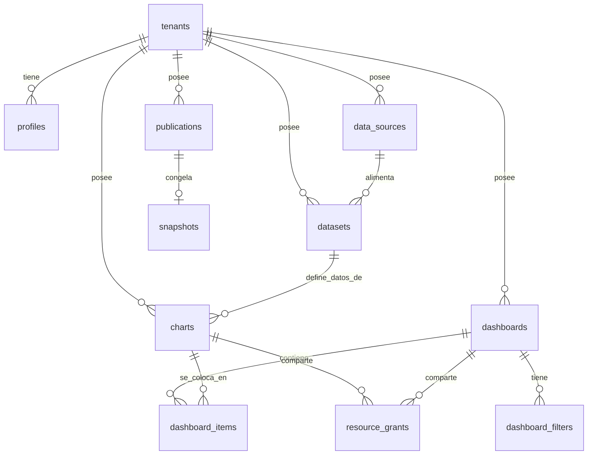
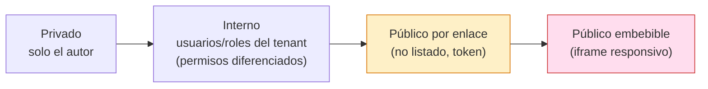
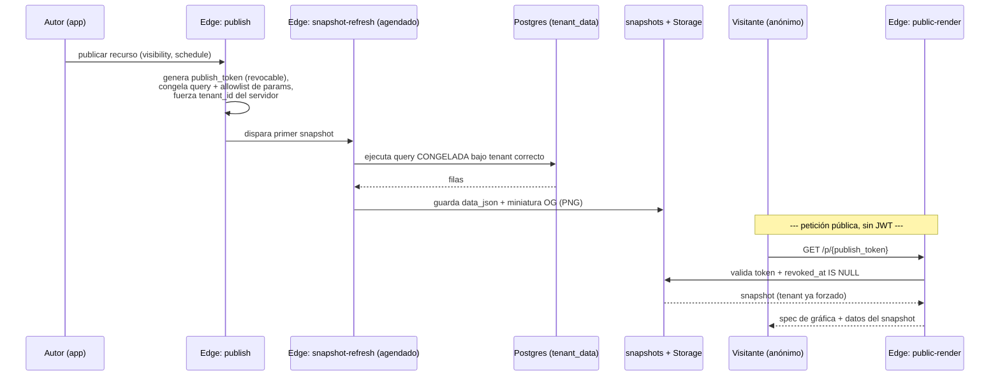

# Plan de Desarrollo — Plataforma SaaS de Creación y Visualización de Dashboards

**Proyecto:** Plataforma multi-tenant de dashboards (working name: *Intersel Insight*)
**Documento:** Plan de arquitectura y desarrollo — v1.0
**Naturaleza:** Plan accionable previo a la implementación. No contiene código de producción; define alcance, arquitectura, modelo de datos, seguridad y roadmap para ejecutarse con Claude Code.

---

## 0. Supuestos declarados

Estos son los supuestos sobre los que se construye todo el plan. Si alguno difiere de la realidad, debe corregirse **antes** de codificar porque varios redefinen la arquitectura de raíz (en particular la tenencia).

| Dimensión | Supuesto adoptado | Impacto si cambia |
|---|---|---|
| **Tenencia** | SaaS **multi-tenant**. Múltiples organizaciones cliente (tenants) comparten la plataforma con **aislamiento estricto** de datos entre ellas. | Es el cimiento del modelo de seguridad. No es retrofiteable. |
| **Volumen** | Datasets **medianos**: hasta ~cientos de miles de filas; CSV de hasta unos pocos MB. | Big data / archivos grandes exigen ingesta por streaming y motor columnar (post-MVP). |
| **Concurrencia** | Decenas de usuarios activos por tenant; picos modestos. | Miles de usuarios concurrentes exigirían réplicas de lectura y caché distribuida. |
| **Idioma** | UI en **español (México)** desde el inicio, arquitectada para i18n. Código y comentarios en inglés. | — |
| **"Interno"** | Significa **siempre dentro del mismo tenant**. No hay compartición cross-tenant salvo por publicación pública explícita. | — |

**Ajuste que recomiendo confirmar:** la correcta separación entre tenants es **independiente de la escala**. Aunque el volumen sea modesto, una fuga cross-tenant es inaceptable y categórica. Por eso el aislamiento por tenant se trata como capa base de seguridad, no como optimización.

---

## 1. Resumen ejecutivo y definición del MVP (80/20)

### Tesis del producto

Combinar las dos mitades del mercado de visualización que hoy viven separadas:

- **La capa de análisis** (Superset/Metabase): datasets, SQL, dashboards con filtros, seguridad por roles.
- **La capa de presentación y publicación** (Datawrapper/Flourish): gráficas que se ven bien *por defecto*, responsivas, y un flujo de publicación/embed de primera clase.

El diferenciador frente a Superset/Metabase es la **publicación**: cada gráfica y cada dashboard puede pasar de privado a embebible en un sitio externo con un flujo tan limpio como el de Datawrapper, pero sobre infraestructura multi-tenant.

### Disciplina 80/20

El MVP incluye el 20% de funcionalidades que entregan el 80% del valor, con una sola excepción deliberada que se explica abajo. Lo demás vive en post-MVP organizado en tres olas.

**Decisión de alcance más importante — y contraintuitiva:** el **embedding básico entra al MVP** aunque "se sienta" como una función avanzada. La razón no es de alcance sino de **arquitectura de seguridad**: un embed público no tiene usuario autenticado, pero el aislamiento multi-tenant depende de la identidad del usuario. La ruta de ejecución anónima que no puede filtrar datos de otro tenant **no se puede agregar después sin rehacer el núcleo**. Por eso entra desde el día uno, en su versión mínima-pero-completa.

A cambio, tres funciones que normalmente "se sienten esenciales" se mueven a post-MVP por ser multiplicadores de complejidad fuera del 20% nuclear: **el constructor visual de consultas (no-SQL)**, **el cross-filtering** y **las anotaciones ricas**.

### Qué entra al MVP (resumen)

1. **Fundación multi-tenant** con aislamiento por tenant como capa base de RLS.
2. **Ingesta express**: subir CSV o pegar tabla → dataset al instante (rampa de agilidad).
3. **Datasets por SQL**: editor estilo SQL Lab + queries guardadas reutilizables.
4. **Constructor visual de gráficas** (sin código) con 6 tipos: KPI, barra, línea, tabla, pastel/dona y área.
5. **Calidad publication-ready** por defecto (paletas accesibles, responsiva, tooltips, transiciones nativas).
6. **Export** de gráfica a PNG y de datos a CSV.
7. **Dashboards** en grid drag-and-drop responsivo.
8. **Filtros globales** (rango de fechas + dropdowns) en la vista interna.
9. **Publicación y embedding** con modelo de visibilidad unificado (privado → interno → enlace público → embed) aplicable a gráficas Y dashboards.
10. **Auth + permisos por objeto** (admin/editor/viewer) dentro de cada tenant.
11. **Caché + snapshots** con modelo de frescura coherente.
12. **Identidad de marca** Intersel con modo claro/oscuro.

### Qué NO entra al MVP

Query builder visual sin SQL, cross-filtering, anotaciones ricas, conexión a Postgres externo, enlaces públicos con contraseña/expiración, RLS a nivel de dato, semantic layer, alertas, mapas, scrollytelling, ML, colaboración en vivo, billing por tenant. Todo ello está mapeado en la sección 8.

---

## 2. Tabla explícita: MVP vs Post-MVP

| # | Funcionalidad | Ola | Razón del corte |
|---|---|---|---|
| 1 | Aislamiento multi-tenant (RLS base) | **MVP** | Cimiento; no retrofiteable. |
| 2 | Fuente Postgres nativo de Supabase (lectura) | **MVP** | Fuente primaria. |
| 3 | Ingesta CSV / pegar tabla | **MVP** | Camino más corto a una gráfica; máxima agilidad y demo sin DB. |
| 4 | Dataset unificado (CSV materializado como tabla) | **MVP** | Un solo motor de ejecución = simplicidad. |
| 5 | Editor SQL (SQL Lab) + queries guardadas | **MVP** | Mecanismo de definición de datos en el MVP. |
| 6 | Constructor **visual de gráficas** (6 tipos) | **MVP** | La parte no-code que sí entra: construir la gráfica. |
| 7 | Calidad publication-ready (defaults, paletas, responsiva) | **MVP** | Diferenciador barato una vez elegida la librería. |
| 8 | Export PNG + CSV | **MVP** | Alto valor, casi gratis; cubre "subir imagen a redes". |
| 9 | Dashboards grid drag-and-drop responsivo | **MVP** | Núcleo del producto. |
| 10 | Filtros globales (fecha + dropdowns) | **MVP** | 80% del valor de filtrado a bajo costo. |
| 11 | Modelo de visibilidad + embed básico | **MVP** | Diferenciador; la seguridad anónima no es retrofiteable. |
| 12 | Tarjetas OG/Twitter + miniatura | **MVP** | Habilita el camino real a redes sociales. |
| 13 | Ejecución anónima segura (snapshots) | **MVP** | Crux de seguridad del proyecto. |
| 14 | Permisos por objeto (admin/editor/viewer) | **MVP** | Gobierna acceso interno diferenciado. |
| 15 | Caché + snapshots con frescura coherente | **MVP** | Evita golpear la BD y controla costos. |
| 16 | Tema de marca + claro/oscuro | **MVP** | Identidad Intersel. |
| 17 | **Constructor visual de consultas** (1 tabla, sin JOINs) | Ola 1 | Pieza más cara relativa a su valor; el SQL la cubre en MVP. |
| 18 | Conexión a Postgres **externo** (solo lectura) | Ola 1 | Superficie de seguridad (credenciales, egress). |
| 19 | Cross-filtering | Ola 1 | Multiplica la complejidad de estado; filtros globales bastan. |
| 20 | Anotaciones sobre gráficas | Ola 1 | UI + modelo extra; los defaults ya elevan calidad. |
| 21 | Personalización por embed + enlaces con expiración/contraseña + oEmbed | Ola 1 | Refinamiento del flujo público. |
| 22 | Query builder con JOINs y lógica compuesta | Ola 2 | Complejidad alta; demanda de usuarios avanzados. |
| 23 | Panel de estilo no-code avanzado + temas reutilizables | Ola 2 | Pulido de apariencia fina (Infogram). |
| 24 | Export PDF / GIF / video + embed analytics | Ola 2 | Valor incremental. |
| 25 | Filtros/cross-filter **dentro** de embeds públicos | Ola 2 | Complica el render anónimo. |
| 26 | Layouts por breakpoint (responsivo manual) | Ola 2 | El auto-responsive cubre el MVP. |
| 27 | Colaboración / dashboards en vivo (Realtime) | Ola 2 | El alcance del MVP no lo usa. |
| 28 | Semantic layer / métricas reutilizables | Ola 3 | BI maduro. |
| 29 | RLS a nivel de **dato** (por usuario sobre datasets) | Ola 3 | Otra bestia distinta a permisos de objeto. |
| 30 | Signed/secure embed por-espectador (estilo Looker) | Ola 3 | Embedding empresarial avanzado. |
| 31 | Tenancy avanzada (schema/DB-per-tenant, residencia, billing) | Ola 3 | Hardening y monetización. |
| 32 | Alertas, fuentes adicionales, mapas, scrollytelling, ML | Ola 3 | Funciones de largo plazo. |

---

## 3. Arquitectura general

El principio rector de seguridad: **dos rutas de ejecución separadas y asimétricas.**

- **Ruta interna autenticada** — corre bajo el contexto RLS del usuario (su tenant + sus permisos). Puede ejecutar las queries definidas, con caché de TTL corto. Es near-live.
- **Ruta pública/anónima** — **no tiene usuario ni JWT**. Nunca ejecuta SQL contra la BD en vivo. Solo sirve **snapshots** pre-computados: resultados ya materializados, con el tenant forzado del lado servidor en el momento de generarlos. Es la única forma de que un embed público sea seguro en multi-tenant.



> Lo marcado en rojo es la ruta pública: nunca toca `TData` en vivo. Lo amarillo (el job agendado) es el único componente que ejecuta la query congelada, y lo hace con el tenant forzado, fuera del camino de la petición pública.

---

## 4. Modelo de datos (Postgres)

### Diagrama entidad-relación (núcleo MVP)



### Tablas (columnas clave)

**Tenencia e identidad**
- `tenants` — `id`, `name`, `slug`, `plan`, `created_at`
- `profiles` — `id` (= `auth.users.id`), `tenant_id` → `tenants`, `display_name`, `role` (`admin` | `editor` | `viewer`), `can_publish` (bool)

**Capa de datos (abstracción unificada)**
- `data_sources` — `id`, `tenant_id`, `type` (`supabase_native` | `csv_upload` | `external_pg`*), `config_json`, `created_by`
- `datasets` — `id`, `tenant_id`, `source_id`, `name`, `kind` (`table` | `sql_query` | `csv_materialized`), `physical_table` (para materializados), `sql_text` (para `sql_query`), `columns_json` (nombre/tipo inferidos), `created_by`. *Las "queries guardadas" son `datasets` de `kind = sql_query`: una sola abstracción.*

**Visualización**
- `charts` — `id`, `tenant_id`, `dataset_id`, `name`, `type` (`kpi`|`bar`|`line`|`table`|`pie`|`area`), `config_json` (encodings, colores, opciones), `created_by`
- `dashboards` — `id`, `tenant_id`, `name`, `created_by`
- `dashboard_items` — `id`, `dashboard_id`, `chart_id`, `layout_json` (`x,y,w,h`)
- `dashboard_filters` — `id`, `dashboard_id`, `type` (`date_range`|`dropdown`), `config_json` (columnas objetivo)

**Publicación y permisos**
- `publications` — `id`, `tenant_id`, `resource_type` (`chart`|`dashboard`), `resource_id`, `visibility` (`private`|`internal`|`public_link`|`public_embed`), `publish_token` (único, revocable), `settings_json` (ocultar título, tema, **allowlist de parámetros**), `refresh_schedule`, `og_image_path`, `created_by`, `revoked_at`
- `resource_grants` — `id`, `tenant_id`, `resource_type`, `resource_id`, `principal_type` (`user`|`role`), `principal_id`, `permission` (`view`|`edit`) — ACL por objeto **dentro** del tenant

**Caché y snapshots**
- `query_cache` — `cache_key` (hash de `sql + params + tenant_id`), `tenant_id`, `result_json`, `computed_at`, `expires_at`
- `snapshots` — `id`, `publication_id`, `data_json` (resultado congelado), `generated_at`

**Diseñadas-para (no se construyen en el MVP):** `annotations`, `themes`, `dataset_row_policies` (RLS de dato), `embed_views` (analytics de embed). El esquema deja `config_json`/`settings_json` extensibles para que encajen sin migración disruptiva.

### Políticas RLS — orden de capas (esto es lo crítico)

**Capa 1 — aislamiento por tenant (antecede a todo):** toda tabla con `tenant_id` lleva una política base. El `tenant_id` viaja en el JWT como custom claim (inyectado por un *custom access token hook* que lo lee de `profiles`).

```sql
-- Ejemplo: política base de tenant en una tabla del esquema app
alter table charts enable row level security;

create policy tenant_isolation_select on charts
  for select using (
    tenant_id = (auth.jwt() -> 'app_metadata' ->> 'tenant_id')::uuid
  );
```

**Capa 2 — permisos por objeto (sobre la capa 1):** la escritura combina rol + grants.

```sql
-- Crear/editar charts: editor o admin del tenant, o grant 'edit' explícito
create policy author_can_write on charts
  for all using (
    tenant_id = (auth.jwt() -> 'app_metadata' ->> 'tenant_id')::uuid
    and (
      (auth.jwt() -> 'app_metadata' ->> 'role') in ('admin','editor')
      or exists (
        select 1 from resource_grants g
        where g.resource_type = 'chart' and g.resource_id = charts.id
          and g.principal_type = 'user'
          and g.principal_id = auth.uid()
          and g.permission = 'edit'
      )
    )
  );
```

**Capa 3 — la ruta pública NO usa RLS de usuario.** El endpoint anónimo lee `snapshots` del lado servidor validando `publish_token` y `revoked_at IS NULL`, devolviendo únicamente la fila de esa publicación. El tenant ya quedó forzado cuando el job generó el snapshot. (Detalle en la sección 6.)

> Las tablas materializadas en `tenant_data` también llevan `tenant_id` + RLS, de modo que aunque cada tabla pertenezca a un solo tenant, el modelo de aislamiento es uniforme en todo el sistema.

---

## 5. Decisiones técnicas con trade-offs

### 5.1 Estrategia de aislamiento multi-tenant → **Esquema compartido + `tenant_id` + RLS**

| Estrategia | Pros | Contras | Veredicto |
|---|---|---|---|
| **Compartido + tenant_id + RLS** | Idiomático en Supabase; una sola migración; operación simple; suficiente a esta escala | Requiere disciplina total en políticas; índices en `tenant_id` obligatorios | **Elegida** |
| Schema-per-tenant | Aislamiento más fuerte; export/borrado por tenant fácil | Cada migración corre N veces; complejidad operativa | Ola 3 (hardening) |
| Database-per-tenant | Aislamiento máximo; residencia de datos | Sobrecosto operativo grande; no paga a esta escala | Solo casos enterprise |

**Por qué:** Supabase está construido alrededor de RLS. A decenas de usuarios y datasets medianos, el esquema compartido con `tenant_id` indexado y políticas estrictas da el mejor balance seguridad/agilidad. La migración a schema-per-tenant queda como opción de Ola 3 sin reescribir la app, porque el `tenant_id` ya es ciudadano de primera clase.

### 5.2 Ejecución segura de consultas → **Edge Function + rol read-only + claims RLS**

El SQL es autoría de roles relativamente confiables (editor/admin) *dentro* de un tenant, pero aun así se sandboxea por completo:

- **Frontera única:** toda ejecución pasa por una Edge Function. El cliente **nunca** recibe credenciales de BD ni envía SQL crudo con `service_role`.
- **Rol dedicado read-only:** `app_readonly` con `SELECT` solamente, `NOSUPERUSER`, **`NOBYPASSRLS`** y `USAGE` únicamente sobre `tenant_data` + esquemas de datos. Como no es dueño de las tablas ni omite RLS, el aislamiento por tenant se aplica incluso sobre SQL arbitrario.
- **Contexto de tenant:** la función establece los claims del JWT en la conexión antes de ejecutar, de modo que RLS filtre al tenant del usuario.
- **Límites duros:** `statement_timeout` corto, envoltura con `LIMIT` y tope de filas devueltas para evitar queries desbocadas.
- **Parámetros:** los valores de filtros (fechas, dropdowns) se pasan **parametrizados** (allowlist por columna), nunca por concatenación de strings. Esto cierra la inyección a tiempo de visualización.

> **A validar en implementación:** el mecanismo exacto de Supabase para fijar `role` y `request.jwt.claims` en una Edge Function, y consideraciones de pooling (PgBouncer en *transaction mode* vs. *session mode* para `SET LOCAL`). El patrón de seguridad es correcto; la API concreta debe confirmarse.

### 5.3 Materialización de CSV → **una tabla por dataset en `tenant_data`**

- Cliente sube CSV (o pega tabla) → se parsea (PapaParse en cliente para feedback inmediato, validación en la Edge Function) → se infieren tipos por columna → `CREATE TABLE tenant_data.ds_<id>` con `tenant_id` + RLS → inserción por lotes.
- **El CSV no se consulta como archivo:** se carga a una tabla. Así existe **un solo motor** (SQL sobre Postgres) tanto para CSV como para tablas nativas. Toda gráfica, filtro y snapshot funciona idéntico sin importar el origen.
- **Límite del MVP:** unos pocos MB / decenas de miles de filas (validado en cliente y servidor). Archivos grandes y `COPY` por streaming → post-MVP.

### 5.4 Modelo de frescura → **tres contratos que no se contradicen**

| Superficie | Fuente | Frescura | Refetch |
|---|---|---|---|
| Vista interna autenticada | `query_cache` (hash + tenant) bajo RLS del usuario | TTL corto (p. ej. 60–300 s) | Botón manual invalida la clave |
| Auto-refresh interno | Re-ejecuta y revalida caché | Intervalo elegido por el dashboard | Regla: **TTL ≤ intervalo** (o el auto-refresh fuerza revalidación) |
| Embed público | `snapshots` | Agenda definida al publicar (p. ej. horaria/diaria) | Independiente; se purga al despublicar |

La clave para que no choquen: la vista interna y la pública son **superficies distintas con contratos de frescura distintos y explícitos**. El usuario sabe que un embed público muestra "datos al {hora del último snapshot}", no en vivo.

### 5.5 Librería de gráficas → **Apache ECharts**

| Librería | Variedad | Rendimiento (datasets medianos) | Export a imagen | Transiciones | API | Veredicto |
|---|---|---|---|---|---|---|
| **ECharts** | Muy amplia (cubre los 6 + futuros: mapas, etc.) | Excelente (canvas, opción WebGL) | **Nativa** (`getDataURL`) | Fuertes y con propósito | Imperativa (wrapper React resuelve) | **Elegida** |
| Recharts | Limitada | Media en volumen | Manual | Básicas | Declarativa, React-native | Descartada |
| Visx | Total (primitivas) | Alta | Manual | Manual | Bajo nivel; construyes todo | Lento para MVP |

**Por qué ECharts:** (1) export PNG nativo, requisito directo del MVP; (2) transiciones nativas que dan el "deleite" tipo Flourish sin costo extra; (3) rendimiento holgado en datasets medianos; (4) breadth que cubre las 6 gráficas del MVP y las de olas futuras (mapas) **sin cambiar de librería**; (5) tooltips/defaults pulidos que habilitan la calidad Datawrapper. El costo (API imperativa, bundle) se mitiga con `echarts-for-react` e imports por componente (tree-shaking). Además, su **render server-side (SVG/canvas)** habilita la generación de miniaturas OG sin un navegador headless.

---

## 6. Arquitectura de publicación y embedding (sección crítica)

Esta es la parte más delicada del proyecto. La premisa: **el render público nunca ejecuta queries del usuario con privilegio ambiente.** Solo sirve datos ya publicados explícitamente.

### 6.1 Espectro de visibilidad (gráficas Y dashboards)



Una sola gráfica o un dashboard completo puede estar en cualquier punto. El cruce a las dos casillas de la derecha es una **acción sensible** (expone datos al exterior) y por eso se gobierna por capacidad `can_publish` (ver 6.5).

### 6.2 Flujo de publicación y render anónimo



### 6.3 Por qué esto no puede filtrar datos de otro tenant

1. **No hay SQL a demanda en público.** El visitante solo pasa un `publish_token`; jamás un query ni parámetros arbitrarios fuera del allowlist.
2. **El tenant se forzó del lado servidor** cuando se generó el snapshot, no se deriva de la petición.
3. **Se sirve desde snapshot, no desde la BD en vivo** con privilegios elevados. Lo peor que un atacante puede obtener con un token válido es el dato que ya es público para ese token.
4. **Revocación inmediata:** despublicar marca `revoked_at`, invalida el token y purga el snapshot + caché.

### 6.4 Redes sociales — el camino realista

**Realidad técnica respetada:** las redes sociales **no renderizan iframes interactivos en el feed**. Por tanto el camino es:

- **Tarjeta de previsualización** (Open Graph + Twitter Cards) con **miniatura PNG auto-generada** en el momento del snapshot.
- El enlace lleva a un **landing público interactivo** (la versión `public_link`).
- Para publicar *dentro* del feed, el usuario usa el **export PNG** del MVP y lo sube nativamente.

No se diseñan embeds en-feed que las plataformas no soportan.

### 6.5 Controles de seguridad del endpoint público

- **Tokens:** aleatorios, no adivinables, revocables. Expiración/contraseña opcionales → Ola 1.
- **iframe / clickjacking:** las páginas de embed público envían `Content-Security-Policy: frame-ancestors *` (o allowlist para embeds restringidos en Ola 1). Las páginas de la **app interna** fijan `frame-ancestors 'self'` para que no sean enmarcables.
- **Rate-limiting y anti-scraping:** límites por token y por IP en la Edge Function; el endpoint sirve únicamente el snapshot publicado (nunca el dataset completo ni parámetros que permitan extraer filas arbitrarias).
- **Permiso para publicar:** exponer al exterior requiere rol `admin` o capacidad `can_publish` explícita; un `viewer` jamás publica.

### 6.6 Costo de generación de imágenes OG

La generación de imágenes es lo más caro de esta sección. Mitigación: las miniaturas se generan **solo al publicar y en cada refresh agendado** (vía render server-side de ECharts a PNG), nunca por petición. Se almacenan en Storage y se sirven estáticas.

---

## 7. Sistema de diseño y guía de UX

### 7.1 Tokens de marca

- **Acento primario:** `#4377BC` (azul Intersel).
- **Escala derivada:** tints y shades del primario para estados (`#2E5A98` hover, `#6B97CE` activo suave, `#EAF1FA` fondos sutiles) + neutrales fríos para superficies.
- **Complementarios funcionales:** ámbar para advertencias, verde para éxito, rojo para error/destructivo, todos en versiones accesibles.
- **Paletas de datos:** categóricas y secuenciales **seguras para daltonismo** por defecto (no el arcoíris ingenuo). Esta es una decisión de producto heredada de Datawrapper: el usuario no debe poder generar una gráfica ilegible sin esfuerzo.
- **Tipografía:** una sans legible para datos (tabular numerals para tablas y KPIs), jerarquía clara, alto contraste.
- **Modos claro y oscuro** como ciudadanos de primera clase desde el inicio (tokens semánticos, no colores hardcodeados).

### 7.2 Principios aplicados

Jerarquía visual con lo más importante "above the fold"; data-ink ratio alto (Tufte); color restringido y semántico; tooltips informativos; transiciones **con propósito** (nunca decorativas); render percibido rápido (skeletons, render progresivo); accesibilidad (contraste AA, navegación por teclado).

### 7.3 Estados como producto, no como detalle

- **Carga:** skeletons que respetan la forma final de cada gráfica.
- **Vacío / primer uso:** **la ingesta CSV es la rampa de entrada, así que el estado vacío ES la primera impresión del producto.** Debe llevar de cero a la primera gráfica en minutos: zona de "arrastra tu CSV o pega una tabla" + ejemplo de un clic.
- **Error:** mensajes accionables (qué pasó, qué hacer), nunca stack traces.
- **Contexto de render embebido/público:** es un modo de render **distinto** al de la app — sin chrome de aplicación, responsivo, carga rápida, marca opcional. Se diseña como vista de primera clase, no como recorte de la UI interna.

### 7.4 Componentes nucleares del MVP

Lienzo de dashboard (grid drag-and-drop), panel de configuración de gráfica (constructor visual), editor SQL con resultados tabulares, selector de dataset, barra de filtros globales, diálogo de publicación (con el espectro de visibilidad y vista previa del embed), y el modo lectura/embed.

---

## 8. Roadmap por fases

### Fase 0 — Setup (cimientos)
- Proyecto Supabase + esquemas (`app`, `tenant_data`), rol `app_readonly`, *custom access token hook* (inyecta `tenant_id`/`role` en el JWT).
- Scaffolding Next.js + Tailwind + shadcn/ui + sistema de tokens (claro/oscuro, `#4377BC`).
- Auth + onboarding mínimo de tenant/usuario.
- **Política RLS base de tenant en todas las tablas + pruebas de aislamiento** (un test que intente y falle en leer datos de otro tenant es criterio de salida de esta fase).

### MVP — orden para demos tempranas
1. **Épica Datos:** ingesta CSV/pegar → materialización → registro de dataset. *(Demo: "subo un CSV y veo la tabla".)*
2. **Épica SQL:** editor SQL Lab + queries guardadas como datasets, ejecución segura vía Edge Function.
3. **Épica Gráficas:** constructor visual de los 6 tipos con defaults publication-ready (empezar por KPI, barra, línea, tabla; luego pastel y área). *(Demo: "convierto un dataset en una gráfica bonita sin código".)*
4. **Épica Export:** PNG + CSV.
5. **Épica Dashboards:** grid drag-and-drop responsivo + filtros globales. *(Demo: "armo un dashboard con varias gráficas y un filtro de fecha".)*
6. **Épica Permisos:** roles admin/editor/viewer + grants por objeto + RLS capa 2.
7. **Épica Publicación:** modelo de visibilidad + snapshots + endpoint público + embed iframe + tarjetas OG. *(Demo cumbre: "publico una gráfica y la incrusto en un sitio externo".)*
8. **Épica Frescura:** caché interna + auto-refresh + refresh agendado de snapshots.

### Ola 1 — Democratización y deleite
Constructor visual de consultas (1 tabla, sin JOINs); Postgres externo de solo lectura; cross-filtering; anotaciones; personalización de embed + enlaces con expiración/contraseña + oEmbed.

### Ola 2 — Escalado y comunicación
Query builder con JOINs; panel de estilo no-code avanzado + temas reutilizables; export PDF/GIF + embed analytics; filtros interactivos dentro de embeds; layouts por breakpoint; colaboración en vivo (Realtime).

### Ola 3 — BI avanzado y tenancy madura
Semantic layer; RLS a nivel de dato; signed embed por-espectador; tenancy avanzada (schema/DB-per-tenant, residencia, cuotas, billing); alertas; fuentes adicionales + archivos grandes; mapas; scrollytelling; ML.

---

## 9. Riesgos principales y mitigaciones

| Riesgo | Severidad | Mitigación |
|---|---|---|
| **Fuga cross-tenant** | Crítica | RLS capa 1 en toda tabla; rol `NOBYPASSRLS`; tenant forzado en snapshots; **suite de tests de aislamiento** como criterio de salida de Fase 0 y gate de CI. |
| **Inyección / exfiltración por SQL** | Crítica | Rol read-only, sin BYPASSRLS; `statement_timeout` + tope de filas; parámetros en allowlist; el cliente nunca arma SQL ni ve credenciales. |
| **Abuso del endpoint público (scraping/DoS)** | Alta | Rate-limit por token e IP; servir solo snapshot (no el dataset); sin params arbitrarios; protección anti-bot en Ola 1. |
| **Fuga / rotación de tokens de publicación** | Alta | Tokens no adivinables y revocables; revocación purga snapshot + caché; expiración opcional (Ola 1). |
| **Clickjacking vía iframe** | Media | `frame-ancestors 'self'` en la app; allowlist para embeds restringidos; embeds públicos aislados de la sesión. |
| **Costo de generación de imágenes OG** | Media | Generar solo al publicar y en refresh agendado; cachear en Storage; nunca por petición. |
| **Rendimiento con datasets en el límite** | Media | Topes de filas; índices en `tenant_id` y columnas de filtro; caché por hash; agregación en SQL, no en cliente. |
| **Scope creep (reintroducir funciones de olas)** | Media | La tabla de la sección 2 es contrato; mover algo al MVP exige justificación explícita. |

---

## 10. Métricas de éxito del MVP

- **Tiempo a primera gráfica (TTFC):** de cero a una gráfica publicable en **< 5 minutos** desde un CSV.
- **Tiempo a primer embed:** de gráfica a iframe funcionando en un sitio externo en **< 2 minutos**.
- **Aislamiento:** **0** fugas cross-tenant en la suite de tests (no negociable).
- **Rendimiento:** render interno de un dashboard típico (6–8 gráficas, datasets medianos) en **< 2 s** con caché tibia; snapshot público en **< 500 ms**.
- **Calidad por defecto:** ≥ **80%** de las gráficas creadas sin tocar opciones de estilo se consideran "presentables" (revisión cualitativa) — valida la promesa publication-ready.
- **Adopción de publicación:** % de gráficas/dashboards que llegan a estado público o interno-compartido (mide si el diferenciador se usa).

---

## 11. Decisiones que requieren tu confirmación antes de codificar

1. **Estrategia de tenencia:** confirmo **esquema compartido + `tenant_id` + RLS** (no schema/DB-per-tenant) para el MVP. ¿De acuerdo, o algún cliente exige aislamiento físico desde el día uno?
2. **Quién crea datasets/queries:** propongo que **editores también puedan** crear datasets SQL y subir CSV (no solo admin), reservando a admin la *configuración de fuentes de datos*. ¿Lo confirmas o prefieres que la creación de datos sea exclusiva de admin?
3. **Quién puede publicar al exterior:** propongo gobernar la publicación pública/embed por capacidad `can_publish` (admin por defecto). ¿Editores deberían poder publicar al exterior sin aprobación?
4. **Frescura pública por defecto:** propongo snapshots con refresh **horario** como default editable por publicación. ¿Te sirve, o el caso de uso necesita algo más cercano a tiempo real (lo cual encarece la ruta pública)?
5. **Confirmación de stack de gráficas:** confirmo **ECharts**. ¿Alguna restricción (licenciamiento, preferencia de equipo) que deba reconsiderar?
6. **Reconfirmación de la decisión A:** el constructor **visual de gráficas** está en el MVP; la **definición del dato** se hace con **SQL** en el MVP; el **query builder visual** entra en Ola 1. Confirmado contigo previamente — lo dejo asentado aquí como base del plan.

---

*Fin del plan v1.0. Listo para committear como `docs/PLAN.md` y usar como fuente de verdad en Claude Code.*
