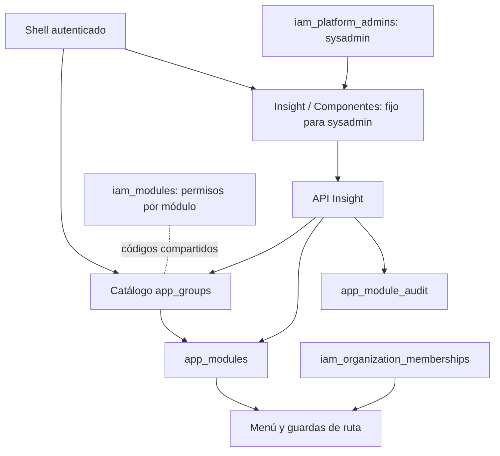

# Componentes (catálogo Insight) — v2

- **Descripción:** administración sysadmin del catálogo de grupos y módulos. El formulario prioriza Nombre y deriva automáticamente un ID ASCII inmutable: espacios consecutivos se vuelven un guion bajo, las vocales con acento se pliegan a su letra y caracteres especiales como Š se descartan. El selector de íconos usa una cuadrícula visual y permite validar nombres adicionales de Lucide; el estado se elige en un campo select dentro del modal y `StateGauge` queda solo en la vista principal. El modal no edita orden ni los indicadores activo/visible.
- **Archivo principal:** `src/app/(app)/insight/modules/page.tsx` y `src/components/insight/catalog-manager.tsx`.
- **Archivos relacionados:** `src/components/insight/state-gauge.tsx`; `src/components/navigation/nav-icon.tsx`; `src/lib/catalog-code.ts`; `src/components/navigation/lucide-icons.ts` (validación de nombres Lucide con carga perezosa del set completo); `src/app/api/insight/{groups,modules}/**/route.ts`; `src/lib/{insight-catalog,insight-catalog-api,insight-db}.ts/js`; `src/lib/nav.ts`; `scripts/{012_insight_module_catalog,013_insight_control_plane,014_catalog_groups_modules,015_remove_ready_state}.sql`.
- **Funciones importantes:** `currentSysadmin`, `listCatalog`, `userCatalogAccess`, `requireCatalogAccess`, `saveCatalog`, `catalogMutation`, `CatalogManager`, `StateGauge`.
- **Padres:** layout autenticado `(app)` y grupo fijo de navegación `Insight`; `iam_platform_admins` determina quién puede administrarlo. Su acceso no depende del catálogo.
- **Hijos:** `app_groups` → `app_modules`; las rutas implementadas se resuelven desde `NAV` y los módulos nuevos usan `/workspace/[code]` hasta que tengan página propia. `app_module_audit` registra cambios de grupos y módulos.
- **Hermanos/interacciones:** los módulos de rutas existentes consumen `requireCatalogAccess`; el shell combina navegación gestionable y el grupo fijo Insight. `iam_modules` agrupa permisos y comparte el código de los módulos gestionables. El trigger crea `operar` y lo concede a roles existentes en cada alta; el shell asigna `/workspace/[code]` a un módulo sin ruta implementada. `apagado` excluye incluso a `sysadmin` en los grupos y módulos gestionables. Roles y Permisos son gestionables, pero sus páginas y API siguen limitadas a sysadmin. Para los demás usuarios, las guardas exigen grupo y módulo disponibles y permiso `operar` por rol o excepción individual.

