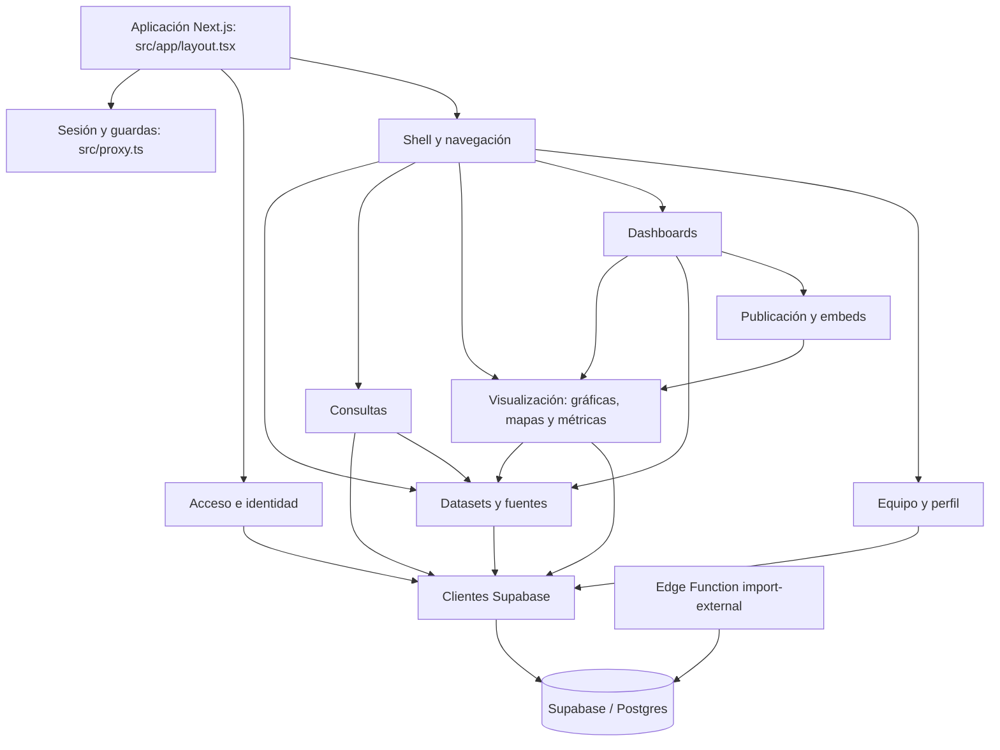

# Mapa general — autoridad, versiones y vista de conjunto

## Autoridad y alcance

Este mapa separa **estado implementado** de **modelo objetivo**. El código y sus imports describen el estado actual; `ARQUITECTURA_BBDD.md` es la referencia designada para el modelo objetivo de datos y organización. Los demás documentos Markdown preexistentes son **referencias no verificadas** hasta contrastarlos.

**Modelo objetivo:** Intersel Insight será multi-organización, no multitenant. Una instalación equivale a un deployment y puede contener varias organizaciones. Los usuarios son globales a la instalación y acceden a los datos de cada organización por su membership, roles y permisos; `organization_id` es el ámbito de pertenencia y aislamiento de los datos. No se agrega `installation_id`.

**Brecha observada:** el código actual aún consulta `profiles`, `tenants` y `tenant_id` en módulos como autenticación, datasets, gráficas y dashboards. Esto describe la implementación presente, no el modelo objetivo; cualquier refactor de esas áreas debe considerar tanto el flujo actual como su destino multi-organización.

**Base aplicada:** `auth` pertenece a Supabase; las tablas propias están en `insight_core` (6), `insight_iam` (10) e `insight_survey` (12). El catálogo de módulos ya se aplicó, aunque la mayor parte de la app sigue siendo v1. Consulta «Estado aplicado» en `ARQUITECTURA_BBDD.md` antes de modificar SQL, permisos o RPC.

## Estado de versión de los archivos de aplicación

Los archivos de aplicación descritos en este mapa se consideran **v1** mientras no tengan una etiqueta explícita de v2. **Perfil**, **Componentes**, **Permisos**, **Roles**, **Usuarios** y **Organizaciones** son v2. La carpeta hermana `../intersel-insight` es la primera versión y se consulta solo para comparación.

| Versión | Archivos |
|---|---|
| **v1** | `src/app/**` excepto Perfil, `src/app/(app)/insight/**`, `src/app/(app)/workspace/**`, `src/app/(app)/permissions/**`, `src/app/(app)/roles/**`, `src/app/(app)/team/**` y `src/app/api/insight/**`; `src/components/**` excepto avatar y `src/components/insight/**`; `src/lib/**` excepto `src/lib/insight-*`; `src/proxy.ts`; Edge Function `supabase/functions/import-external/index.ts`. Las guardas nuevas `layout.tsx` en rutas existentes no migran el resto de esos flujos. |
| **v2** | Perfil: `src/app/(app)/profile/{page.tsx,actions.ts,name-avatar-form.tsx,password-form.tsx}` y `src/components/avatar-cropper.tsx`. Administrador Insight: `src/app/(app)/insight/modules/page.tsx`, `src/components/insight/catalog-manager.tsx`. Organizaciones: `src/app/(app)/insight/organizations/page.tsx`, `src/components/insight/organizations-manager.tsx`. Encuestas (consulta inicial): `src/app/(app)/surveys/**`, `src/components/insight/{surveys-manager,survey-detail-view}.tsx` y `src/lib/insight-surveys.ts`. Área provisional: `src/app/(app)/workspace/[code]/page.tsx`. Permisos: `src/app/(app)/permissions/page.tsx`, `src/components/insight/permissions-manager.tsx`. Roles: `src/app/(app)/roles/page.tsx`, `src/components/insight/roles-manager.tsx`. Usuarios: `src/app/(app)/team/{page.tsx,actions.ts,layout.tsx}`, `src/components/insight/{users-manager,user-form-modal}.tsx`, `src/lib/insight-users.ts`. API `src/app/api/insight/**` y servicios `src/lib/insight-*`. |

Esta marca expresa el linaje/estado acordado, no la compatibilidad con el esquema objetivo. Un archivo v1 puede requerir migración a organizaciones. Cambia una marca a v2 solo cuando ese flujo se haya adaptado y verificado; conserva el registro de módulos pendientes en este mapa.

Las relaciones marcadas **directas** se observan en imports o composición de componentes. Las marcadas **flujo** representan una relación funcional visible entre archivos aunque no exista un import directo. Este documento es un índice de navegación, no reemplaza la lectura de la función que se vaya a cambiar.

## Vista general

