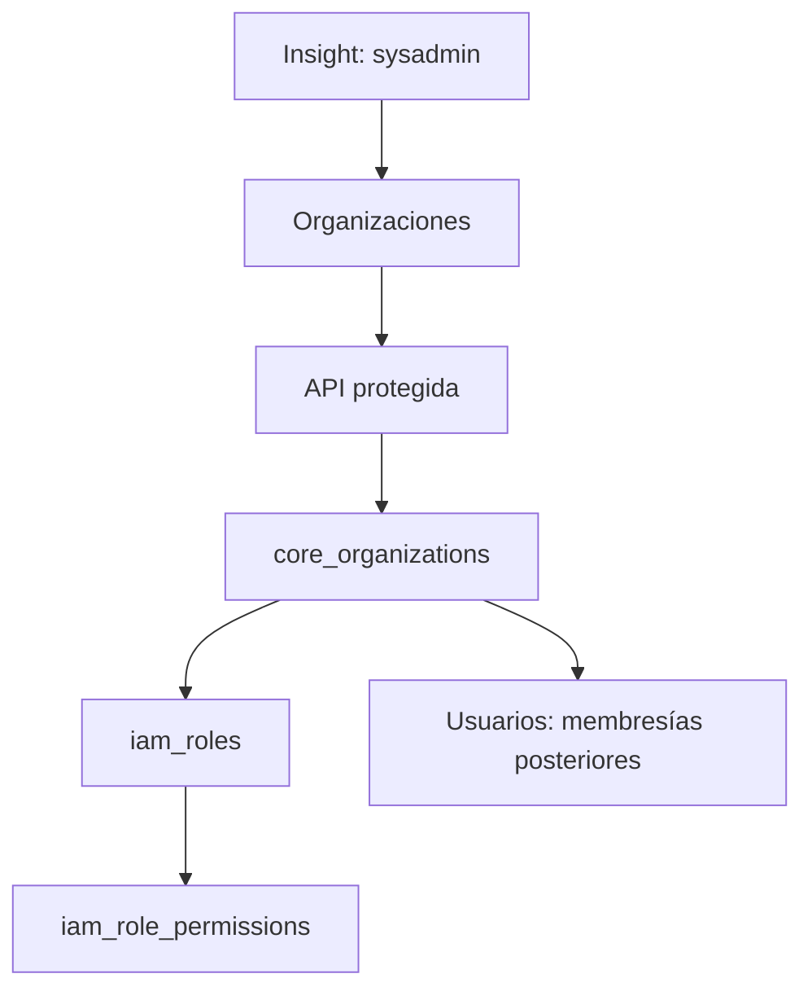

# Organizaciones de Insight — v2

- **Descripción:** directorio sysadmin de organizaciones, alta y edición de nombre, zona horaria y estado. El ID se deriva del nombre al crear y permanece fijo. El prefijo de código de tres caracteres se precarga desde el nombre y puede editarse durante el alta. Cada alta crea cinco roles base sin asignar a la cuenta maestra como miembro.
- **Archivo principal:** `src/app/(app)/insight/organizations/page.tsx` y `src/components/insight/organizations-manager.tsx`.
- **Archivos relacionados:** `src/app/api/insight/organizations/route.ts`, `src/lib/insight-organizations.ts`, `src/lib/survey-codes.ts`, `src/lib/catalog-code.ts`, `src/lib/insight-catalog.ts`, `src/lib/nav.ts`, `scripts/023_organization_prefix_survey_codes.sql` y `insight_core.core_organizations`.
- **Funciones importantes:** `listOrganizations`, `saveOrganization`, `OrganizationsManager`, `OrganizationDialog`.
- **Padres:** shell autenticado y grupo fijo Insight; página y API exigen `sysadmin`.
- **Hijos:** `core_organizations` → `iam_roles` → `iam_role_permissions`; las membresías se agregan después desde Usuarios.
- **Hermanos/interacciones:** Componentes gobierna las pantallas gestionables, mientras Organizaciones crea el ámbito de acceso que consumen Usuarios y Roles. La cuenta maestra permanece fuera de las membresías.

