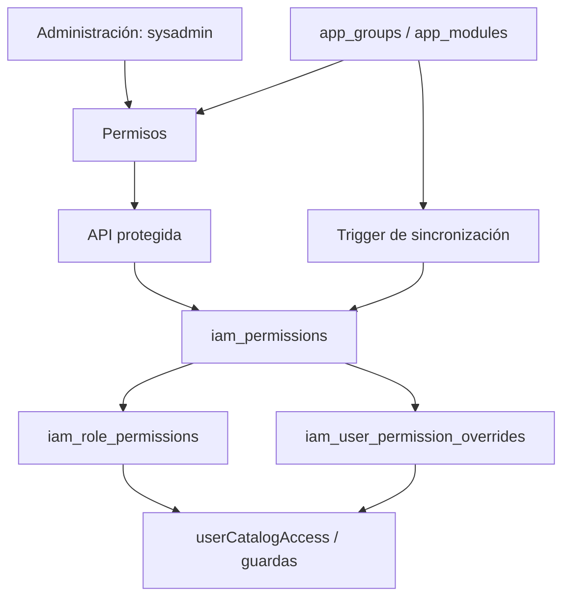

# Permisos de Administración — v2

- **Descripción:** catálogo de permisos por grupo y módulo, con totales, filtros heredados de selección múltiple, búsqueda expandible, edición de descripción y confirmación de eliminación. Los filtros Lucide cuentan selecciones y encadenan opciones disponibles grupo → módulo → acción; el buscador compacta los filtros a iconos. El alta despliega un formulario en la página y permite marcar varias acciones con botones del mismo estilo; solo ofrece las acciones aún libres `crear`, `editar`, `eliminar` y `exportar`. La API las inserta en una sola transacción. `operar` se provisiona automáticamente y no se elimina desde esta interfaz.
- **Archivo principal:** `src/app/(app)/permissions/page.tsx` y `src/components/insight/permissions-manager.tsx`.
- **Archivos relacionados:** `src/app/api/insight/permissions/route.ts`, `src/lib/insight-permissions.ts`, `src/lib/insight-catalog.ts`, `src/lib/nav.ts`, `scripts/016_catalog_operate_permissions.sql`, `src/components/navigation/confirm-dialog.tsx` y `src/components/insight/permission-filter-controls.tsx`.
- **Funciones importantes:** `listManagedPermissions`, `createManagedPermissions`, `updateManagedPermission`, `deleteManagedPermission`, `userCatalogAccess`, `PermissionsManager`.
- **Padres:** layout autenticado `(app)` y grupo de navegación **Administración**; la página y cada operación API exigen `sysadmin` y módulo `insight_permissions` habilitado en el catálogo.
- **Hijos:** `insight_iam.iam_modules` → `iam_permissions` → `iam_role_permissions` y `iam_user_permission_overrides`.
- **Hermanos/interacciones:** `app_groups` y `app_modules` dan la estructura visual; `iam_modules` comparte el código del módulo gestionable. `operar` se evalúa en el menú y en `requireCatalogAccess` con prioridad de la excepción individual sobre el rol. La concesión a roles existentes preserva la visibilidad inicial; nuevas acciones requieren asignación posterior para producir efectos de autorización.

