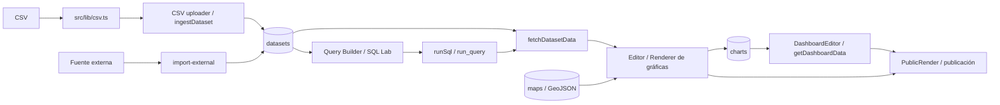

# Relaciones entre módulos y contratos técnicos

## Relaciones inmediatas por flujo

| Cambio en… | Revisar inmediatamente… | Motivo |
|---|---|---|
| Sesión o autorización | `src/proxy.ts`, `src/lib/supabase/proxy.ts`, `src/lib/auth.ts`, Server Actions afectadas | Guardas, identidad y permisos se validan en más de una capa. |
| Columnas/ingestión de dataset | `src/lib/csv.ts`, `csv-uploader.tsx`, `datasets/new/actions.ts`, `fetchDatasetData`, RPC de ingestión | El nombre y tipo de columna fluyen a tabla física, consulta y visualización. |
| Ejecución SQL | `sql/actions.ts`, `query-builder.ts`, `datasets.ts`, RPC/función SQL consumida | Generación, límites, filtrado y permisos están repartidos. |
| Configuración de gráfica | `lib/charts.ts`, editor, renderer, acciones, vista pública | El mismo `ChartConfig` se crea, persiste y consume en varios contextos. |
| Layout o datos de dashboard | `lib/dashboards.ts`, editor, vista, acciones de dashboard y publicación | El servidor arma items/filtros/layout y el cliente los presenta/edita. |
| Embed/publicación | acciones de charts y dashboards, `/p/[token]`, `public-render.tsx`, Proxy | Configuración autenticada y render público son partes del mismo flujo. |
| Fuente externa | página/actions, componente, Edge Function, tablas y RPC de ingestión | La UI administra la fuente; la función realiza conexión e importación. |

## Contratos técnicos observados

- Framework declarado: Next.js `16.2.9`, App Router; React `19.2.4`; TypeScript. El archivo raíz `src/proxy.ts` exporta `proxy` y usa `src/lib/supabase/proxy.ts`.
- Persistencia/acceso: `@supabase/ssr` y `@supabase/supabase-js`; claves públicas para cliente y `SUPABASE_SERVICE_ROLE_KEY` para el cliente administrativo.
- Gráficas: ECharts a través de `echarts-for-react`; exportación usa `html2canvas-pro` y `jspdf` (confirmar consumidores con búsqueda de imports al cambiar esa área).
- Archivos de entrada importantes: `package.json`, `next.config.ts`, `tsconfig.json`, `src/app/layout.tsx`, `src/proxy.ts`.
- Contratos consultados directamente desde código incluyen `profiles`, `tenants`, `datasets`, `dataset_row_policies`, `query_cache`, `dashboards`, `dashboard_items`, `dashboard_filters`, `charts` y `maps`. Reflejan la implementación observada, no el modelo objetivo multi-organización, ni confirman el estado remoto de la base.
