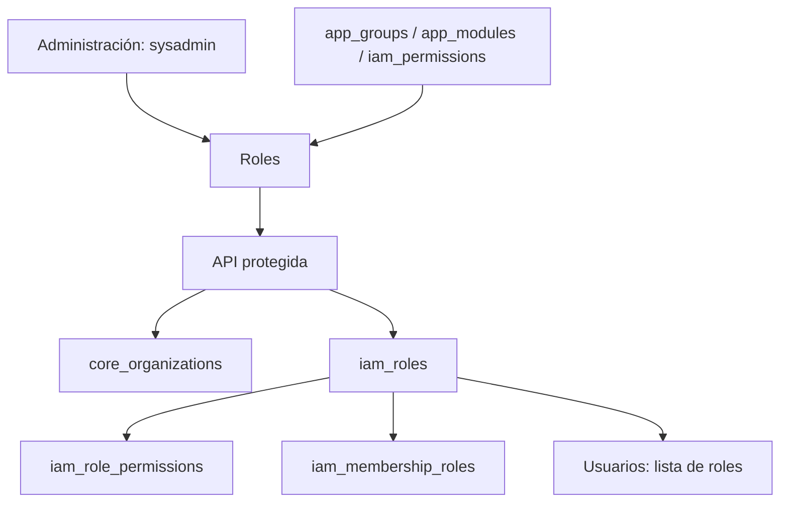

# Roles de Administración — v2

- **Descripción:** gestión de roles por organización con listado, ordenación, búsqueda, lápiz de edición y papelera. El modal de alta/edición reúne nombre, descripción y permisos con grupos, filtros, módulos y resumen de cambios. `owner` es obligatorio y no se elimina; `sysadmin` es un rol global interno en `iam_platform_admins`, reservado fuera de este catálogo. Los demás roles requieren estar sin miembros ni concesiones de recursos para poder eliminarse.
- **Archivo principal:** `src/app/(app)/roles/page.tsx` y `src/components/insight/roles-manager.tsx`.
- **Archivos relacionados:** `src/components/insight/role-form-modal.tsx`, `src/components/insight/role-permission-workspace.tsx`, `src/app/api/insight/roles/route.ts`, `src/lib/insight-roles.ts`, `src/lib/catalog-code.ts`, `src/lib/insight-catalog.ts`, `src/lib/nav.ts` y `src/app/(app)/layout.tsx`.
- **Funciones importantes:** `listRoleWorkspace`, `saveInsightRole`, `deleteInsightRole`, `RolesManager`, `RoleFormModal`, `RolePermissionWorkspace`.
- **Padres:** layout autenticado `(app)` y navegación **Administración**; página y API requieren `sysadmin` y módulo `insight_roles` habilitado en el catálogo.
- **Hijos:** `insight_iam.iam_roles` pertenece a `insight_core.core_organizations`; `iam_role_permissions` asigna permisos y `iam_membership_roles` asigna roles a miembros.
- **Hermanos/interacciones:** lee `app_groups` → `app_modules` → `iam_permissions` para organizar el selector; Usuarios lee los roles de la organización para asignarlos. El modal edita datos y permisos en una transacción, también en roles predefinidos, y conserva permisos IAM anteriores ajenos al catálogo gestionable. La migración `scripts/017_single_sysadmin.sql` prohíbe el código `sysadmin` en `iam_roles`.

