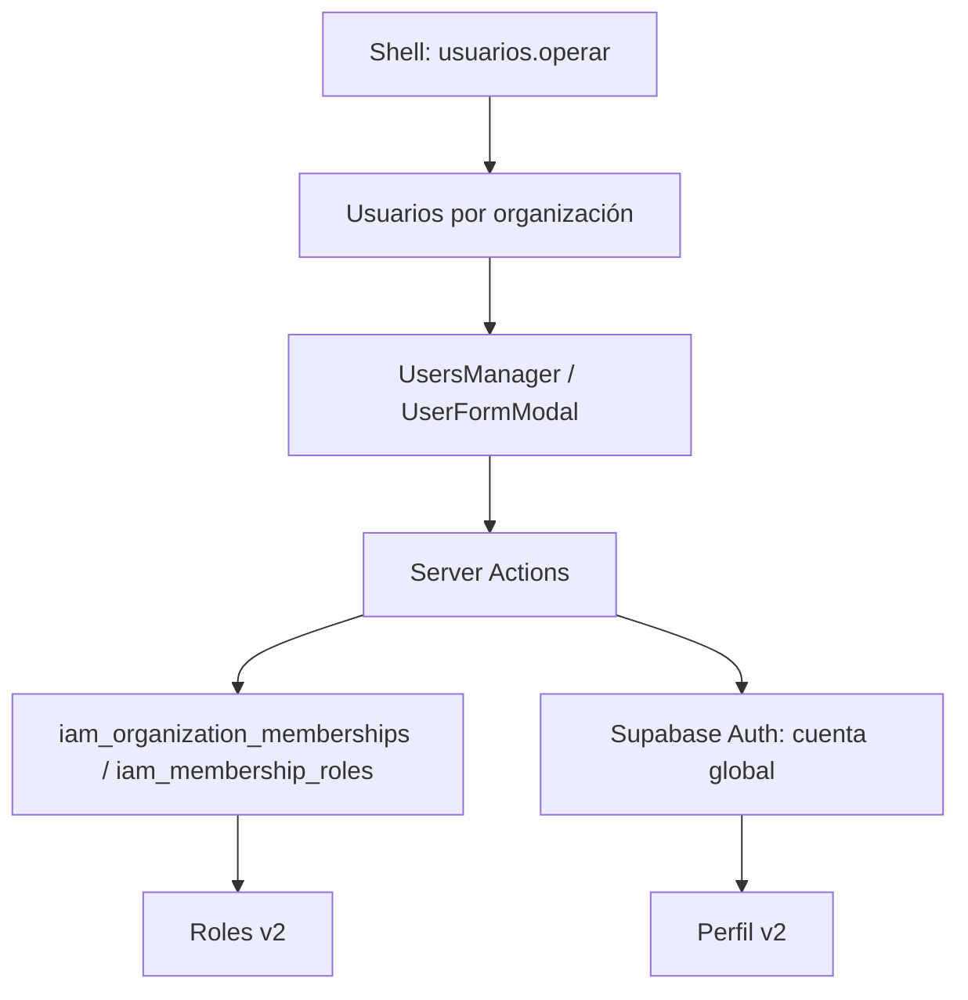

# 10. Usuarios y asignación de roles — v2

- **Descripción:** alta, búsqueda expandible, filtros multiselección encadenados por rol y estado, ordenación, estado, edición, retiro de membresía y reseteo de contraseña de usuarios por organización. Los filtros solo ofrecen opciones presentes en los miembros disponibles. La cuenta Auth es global; el retiro solo elimina la membresía. El rol `owner` activo no puede quedar sin titular. El `sysadmin` global queda fuera de la lista y de todas las acciones de Usuarios.
- **Archivo principal:** `src/app/(app)/team/page.tsx` y `src/components/insight/users-manager.tsx`.
- **Archivos relacionados:** `src/app/(app)/team/actions.ts`, `src/app/(app)/team/layout.tsx`; `src/components/insight/user-form-modal.tsx`; `src/lib/insight-users.ts`; `src/lib/supabase/{admin,server}.ts`; migración `scripts/017_single_sysadmin.sql`; RPC `list_invitable_orgs`, `list_org_members`, `list_org_roles`, `iam_has_permission`, `add_organization_member`.
- **Funciones importantes:** `listUserOrganizations`, `memberRoleIds`, `createUser`, `updateTeamMember`, `changeTeamMemberStatus`, `removeTeamMember`, `resetTeamMemberPassword`, `UsersManager`, `UserFormModal`.
- **Padres:** shell autenticado, guarda `usuarios.operar` del catálogo y permisos IAM `members.invite`, `members.update`, `members.remove`; el reseteo de contraseña global exige además `sysadmin`.
- **Hijos:** `auth.users` y `core_user_profiles` para identidad global; `iam_organization_memberships` y `iam_membership_roles` para acceso de cada organización.
- **Hermanos/interacciones:** Roles v2 define las opciones asignables. Perfil comparte la identidad global. Suspender o retirar una membresía afecta el acceso a esa organización y preserva las demás.

